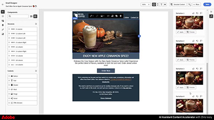
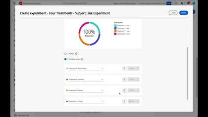
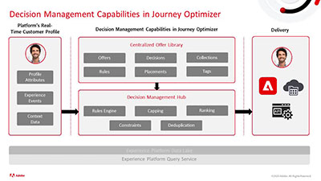
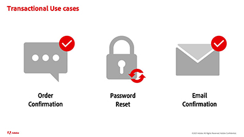

# Journey Optimizer 教學課程

Journey Optimizer 可讓公司建立一致的情境式個人化客戶體驗。它可順暢引導客戶完成與品牌的整個歷程，從最初的接觸點一直到離開網站的那一刻，確保每個接觸點均可獲得具連結性且令人滿意的體驗。

本使用手冊包含 Adobe Journey Optimizer 功能和特性的相關影片和教學課程。透過參加 [Journey Optimizer 挑戰](https://experienceleague.adobe.com/zh-hant/docs/journey-optimizer-learn/challenges/introduction-and-prerequisites)，練習運用您學到的知識。

## 最新 Experience League 直播活動

* **[AI Bash — 解鎖 Adobe Experience Platform 應用程式和行銷活動中的 AI 助理強大功能](https://experienceleague.adobe.com/zh-hant/docs/events/experience-league-live-recordings/episodes/exl-live-episode-09-26-24)**
  *探索 AI 助理如何在 Adobe Experience Cloud 應用程式和 Adobe Campaign 中轉換客戶互動並提高工作效率。*
* **[夏日焦點 — Adobe Journey Optimizer 中三個不容錯過的功能](https://experienceleague.adobe.com/zh-hant/docs/events/experience-league-live-recordings/episodes/exl-live-episode-08-28-24)**
  *透過 Adobe Journey Optimizer 的三項功能 (歷程實驗、頻率上限、多語言傳送訊息)，今夏為您的客戶帶來更充裕的參與度。*
* **[Journey Optimizer 的全新程式碼型體驗頻道](https://experienceleague.adobe.com/zh-hant/docs/events/experience-league-live-recordings/episodes/exl-live-episode-04-24-24)**
  *瞭解如何使用以開發人員為中心的動作來啟用傳入表面和精細的個人化控制。*

## 工作人員選擇

<table>
<tr>
    <td>
    
    

      <a href="../content-management/ai-assistant-content-accelerator-overview.md">
    <strong>使用 AI 助理內容加速器建立內容</strong>
    </a>
    

    

    <em>了解如何使用 AI 助理內容加速器為文字和影像產生主動式內容變化版本建議。
</em>
    

  </td>
    <td>
    
    

      <a href="../experimentation/content-experiments-for-emails.md">
    <strong>設定電子郵件行銷活動的內容實驗 </strong>
    </a>
    

    

    <em>瞭解如何設定內容實驗以進行 A/B 測試並探索電子郵件內容，以最佳方式推動您的業務目標。</em>
    

  </td>
  </td>
    <td>
    
    

      <a href="../decision-management/create-decisions.md">
    <strong>決策管理功能簡介 </strong>
    </a>
    

    

    <em>影片內容包括決策管理功能解決的企業難題、重要功能、基礎架構和主要使用案例。

</em>
    

  </td>
</tr>
<tr>
  <td>
    
    

      <a href="../create-journeys/use-case-transactional-journey.md">
    <strong>使用案例 - 異動歷程 </strong>
    </a>
    

    

    <em>瞭解異動歷程的適用使用案例。 瞭解如何建立異動歷程，以及套用哪些最佳實務。</em>
    

  </td>
    <td>
    
    

      <a href="../personalize-content/use-contextual-event-information-for-personalization.md">
    <strong>使用內容事件資訊進行個人化 </strong>
    </a>
    

    

    <em>瞭解如何使用歷程中的內容事件資訊來個人化訊息。</em>
    

  </td>
  </td>
    <td>
    
    

      <a href="../report-and-monitor/live-and-global-reports.md">
    <strong>即時和全域報告 </strong>
    </a>
    

    

    <em>瞭解即時和全域報告之間的差異、如何存取和分析歷程和訊息特定報告，以及如何修改報告控制面板。

</em>
    

  </td>
</tr>
</table>

