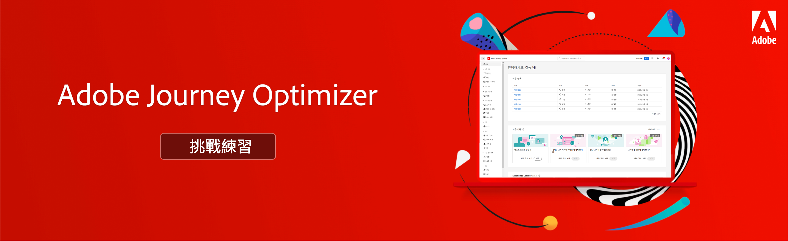

# Journey Optimizer挑戰 — 簡介和先決條件

挑戰提供了實施您所學知識所需的方案和要求。 挑戰可幫助您評估您的技能水準並找出知識差距。

本節中的每個挑戰都說明您將實施的不重複使用案例。 目標對象（角色）和所需技能將列在每個挑戰的開頭。

## 先決條件

### 系統要求

* 存取Journey Optimizer沙箱 — 我們建議您在專屬的訓練沙箱中完成挑戰。
* AEM Assets Essentials必須布建給您的執行個體
* 必須為交易式和行銷訊息設定電子郵件通道

### 存取權限

您需要下列存取權限：
* *Journey Manager* 或 *歷程管理員*
* 檢視測試設定檔及其屬性

>[!NOTE]
> 這些練習是根據Luma樣本資料編製的。 建議您設定使用範例資料設定的訓練沙箱。 請造訪教學課程 [設定訓練沙箱](/help/tutorial-configure-a-training-sandbox/introduction-and-prerequisites.md) 以取得詳細指示。

### 必要動作

* 如果您是Adobe Journey Optimizer的新手，請完成本課程 [歷程管理員和管理員專用Journey Optimizer快速入門](https://experienceleague.adobe.com/?recommended=JourneyOptimizer-U-1-2021.1).

## 故事

Luma是一家虛構的運動服裝公司，在多個國家設有門店，線上有網站，移動應用。 Luma使用Adobe Journey Optimizer來為客戶提供連結、情境式和個人化的體驗。

Luma正尋求推廣其最新的服裝和齒輪系列，並推動現有客戶的銷售。 我們聘請您在Journey Optimizer中實作Luma行銷和保留促銷活動。

## 您的挑戰

<table>
<tr>
<td>
 

      
      

  </td>
  <td>
   <strong><a href="summer-collection-announcement-challenge.md">建立夏季系列公告 </strong>
    </a>
      

      <em>建立歷程，將夏季系列公告電子郵件傳送至現有客戶的區段。 </em>
      

      <b>所需技能：</b>
      <li><a href="https://experienceleague.adobe.com/docs/journey-optimizer-learn/tutorials/profiles-segments-subscriptions/create-segments.html"> 建立區段</li>
      <li><a href="https://experienceleague.adobe.com/docs/journey-optimizer-learn/tutorials/create-messages/create-emails/import-and-author-html-email-content.html">匯入及編寫 HTML 電子郵件內容</li>
      <li><a href="https://experienceleague.adobe.com/docs/journey-optimizer-learn/tutorials/create-journeys/use-case-read-segment.html">使用案例 - 讀取區段</li>
  </td>
  </tr>
  <tr>
  <td>
  

    
  </td>
  <td>
      <a href="order-confirmation-challenge.md">
    <strong><a href="order-confirmation-challenge.md">建立訂單確認</strong>
    </a>
    

    

    <em>測試您關於如何建立和個人化交易式訊息的知識
    </em>
    

    <b>所需技能：</b>
      <li><a href="https://experienceleague.adobe.com/docs/journey-optimizer-learn/tutorials/create-messages/create-email-content-with-the-message-editor.html"> 使用訊息編輯器建立電子郵件內容</li>
      <li><a href="https://experienceleague.adobe.com/docs/journey-optimizer-learn/tutorials/personalize-content/use-contextual-event-information-for-personalization.html">使用內容事件資訊進行個人化</li>
      <li><a href="https://experienceleague.adobe.com/docs/journey-optimizer-learn/tutorials/personalize-content/use-helper-functions-for-personalization.html?lang=en">使用協助程式功能進行個人化</li>
  </td>
  </tr>
  <tr>
    <td>
    

    
    

    <td>
    

      <strong>建立產品補充通知（即將推出）</strong>
    </a>
    

    

    <em>當先前缺貨的項目重新存貨時，通知客戶</em>
    

  </td>
  </tr>
  <tr>
    <td>
    

    
    

    <td>
    

      <a>
    <strong>建立忠誠度狀態歡迎電子郵件（即將推出） </strong>
    </a>
    

    

    <em>當忠誠度客戶移至新層級時，請傳送電子郵件，祝賀並告知他們新的優點</em>
    

  </td>
  </tr>
</table>
