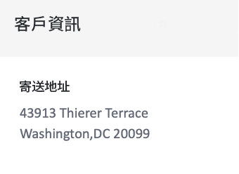

# 建立訂單確認交易式電子郵件


| 挑戰 | 建立訂單確認交易式電子郵件 |
|---|---|
| 角色 | Journey Manager |
| 所需技能 | <ul><li>[使用訊息編輯器建立電子郵件內容](https://experienceleague.adobe.com/docs/journey-optimizer-learn/tutorials/create-messages/create-email-content-with-the-message-editor.html?lang=en)</li> <li>[使用內容事件資訊進行個人化](https://experienceleague.adobe.com/docs/journey-optimizer-learn/tutorials/personalize-content/use-contextual-event-information-for-personalization.html?lang=en)</li><li>[使用協助程式功能進行個人化](https://experienceleague.adobe.com/docs/journey-optimizer-learn/tutorials/personalize-content/use-helper-functions-for-personalization.html?lang=en)</li></ul> |
| 要下載的資產 | [訂購確認資產](/help/challenges/assets/email-assets/order-confirmation-assets.zip) |

## 故事

Luma正在啟動其線上商店，希望在客戶下訂單後，提供訂單確認電子郵件，以確保提供良好的客戶體驗。


## 您的挑戰

建立歷程，當Luma客戶完成線上訂單時傳送訂單確認電子郵件。

>[!BEGINTABS]

>[!TAB 工作]

1. 建立名為「您的姓名_訂購確認」的歷程
2. 使用事件：LumaOnlinePurchase作為觸發器

3. 建立訂單確認電子郵件：

* 類別交易 — 請務必選取交易式電子郵件表面
* 主旨行必須與收件者的名字個人化，且必須包含「感謝您購買」的片語

依照Luma品牌准則，電子郵件的結構應如下 — 您可以使用 **Luma — 訂單摘要** 範本並加以修改：

<table>
<tr>
<td>
  <div>
     <strong> 標題區段</strong>
      </div>
  </td>
  <td>
    <strong>Luma標誌</strong>
      <p>
     <li>luma_logo.png</li>
    <li>大小35%，居中為白色背景 </li>
    <li>應該會有luma網站的連結：https://publish1034.adobedemo.com/content/luma/us/en.html</li>
    <p>
    </td>
  </tr>
  <tr>
  <td>
  <div>
    <strong>訂購確認部分
    </strong>
  </td>
  <td>
    <strong>影像</strong><p>
    <li>luma-transactional-order-confirmation-2.jpg </li>
    <li>利潤：頂部、底部(10)<div>
    <p>
    <strong>文字</strong><p>
    <em>嗨{名字}</em><p>
    <li>對齊方式：lef  </li>
   <li>文本顏色：rgb(101, 106, 119);font-size:14px</li>
    <li>邊框間距：左(95)、右(95)</li><div>
    <p>
     <em>已下訂單。
    <p>您的包出貨後，我們會向您發送一封包含跟蹤號碼的電子郵件，以便您跟蹤訂單。</p></em>
    </strong><p>
    <li>對齊方式：lef  </li>
    <li>文本顏色：rgb(101, 106, 119);font-size:14px </li>
    <li>邊框間距：左(95)、右(95)</li><div>
    </a><p>
    <em>收貨方：<p>
    <p>名字姓氏</p>
    街<p>
    城市、州、郵遞區號</p></em>
    <strong>按鈕:</strong></p>
   <p><em>檢視順序</em></p>
      <li>背景顏色：rgb(25, 121, 195)</li>
      <li>文本顏色：白色</li>
      <li>無邊框</li>
      <li>高度：40</li>
      <li>將連結新增至您所選擇的網站 </li>
      <li>左對齊上面的文字(提示：使用容器邊界)</li>
  </td>
 <tr>
<td>
  <div>
     <strong>訂單詳細資訊部分</strong>
      </div>
      <p>提示:
      <li>這是內容事件資訊。</li>
      <li>使用幫助程式函式：每個</li>
      <li>切換至程式碼編輯器格式以新增內容資料。 <li>
      <li>使用DIV標籤將資訊放入容器中。</li>
  </td>
  <td>
    <strong>Header</strong>
    <p>
    <em>訂單{採購訂單編號}</em>
    </p>
    <strong>訂購的產品清單：
  </strong>
  <p>每個項目的格式應如下所示：
    
</p>
<strong>產品影像：</strong>
<li>類別：購物車椅
<li>樣式：邊框框：min-height:40px</li>
<li>邊框間距上下：20px</li>
<li>邊框間距左側：80px</li>
<li>border-radius:0px</li>
<li>作為容器的背景影像</li>
<li>背景位置：0% 50%</li>
<li>背景大小：60px</li>
<li>背景重複：無重複</li>
<p>
<strong>價格:</strong>
<li>格式= H5</li>
<li>style = box-sizing:border-box</li>
<li>margin-bottom:5px</li>
<li>margin-top:0px;</li>
<p>
<strong>名稱和數量：</strong>
<li>class=text-small</li>
<li>style=box-sizing:邊框框</li>
<li>邊框間距：5px</li>
<li>顏色：rgb(101, 106, 119)</li>
<li>font-size:14px</li>
<p>
</td>
  </tr>
</table>


>[!TIP]
>
>若要讓您疑難排解歷程，最佳實務是在逾時或錯誤的情況下，為所有訊息動作新增替代路徑。


>[!TAB 檢查您的工作]

觸發您在測試模式中建立的歷程，並傳送電子郵件給您自己：

1. 按一下眼睛符號來顯示隱藏的值：
   1. 在電子郵件參數中，按一下T符號（啟用參數覆蓋）
      
   2. 按一下「Address（地址）」欄位
   3. 在下一個畫面中，以括弧新增您的電子郵件地址： *yourname@yourdomain* 在運算式編輯器中，按一下「確定」。
2. 將歷程置於測試模式
3. 使用下列參數觸發事件：
   * 將設定檔識別碼設為：Jenna_Palmer9530@emailsim.io
   * 事件類型：commerce.purchases
   * 名稱：雪碧瑜伽伴侶套件
   * 數量：1
   * 總價：61
   * 訂單編號：6253728
   * SKU:24-WG080
   * productImageURL: <https://publish1034.adobedemo.com/content/dam/luma/en/products/gear/fitness-equipment/luma-yoga-kit-2.jpg>

您應會收到包含指定產品的個人化購買確認電子郵件。

* 主旨行應以測試設定檔的名字開頭：珍娜
* 訂單詳細資訊區段應填入您在測試時輸入的訂單詳細資料
* 客戶資訊應該有您的測試設定檔的城市和郵遞區號：

   華盛頓特里埃爾泰勒斯43913 20099


>[!TAB 成功標準]

** 歷程


** 電子郵件

**主旨行：**

{{ profile.person.name.firstName }}，感謝您的購買！


**訂單詳細資訊部分：**


以下是您的程式碼應呈現的外觀：

標頭:

```javascript
Order: {{context.journey.events.1627840522.commerce.order.purchaseOrderNumber}}
```

產品清單：

使用協助程式函式「each」來建立產品清單。 以下是您的程式碼應呈現的外觀：

```javascript
{{#each context.journey.events.1911672547.productListItems as|product|}}
<div class="cart-item-chair" style="box-sizing:border-box;min-height:40px;padding-top:20px;padding-bottom:20px;padding-left:80px;border-radius:0px;background-image:url({{product._wwfovlab065.productImageURL}});background-position:0% 50%;background-size:60px;background-repeat:no-repeat;">
<h5 style="box-sizing:border-box;margin-bottom:5px;font-size:16px;line-height:20px;margin-top:0px;">${{product.priceTotal}}.00</h5>
<div class="text-small" style="box-sizing:border-box;padding-top:5px;color:rgb(101, 106, 119);font-size:14px;">{{product.name}}</div><div class="text-small" style="box-sizing:border-box;padding-top:5px;color:rgb(101, 106, 119);font-size:14px;">Quantity: {{product.quantity}}</div></div><div class="divider-small" style="box-sizing:border-box;height:1px;margin-top:10px;margin-bottom:10px;background-color:rgb(209, 213, 223);"> </div>
{{/each}}

Total: ${{context.journey.events.1627840522.commerce.order.priceTotal}} 
```

**客戶資訊部分**



個人化應該如下所示：

```javascript
{{profile.homeAddress.street1}}
{{profile.homeAddress.city}},{{profile.homeAddress.state}} {{profile.homeAddress.postalCode}}
```

>[!ENDTABS]