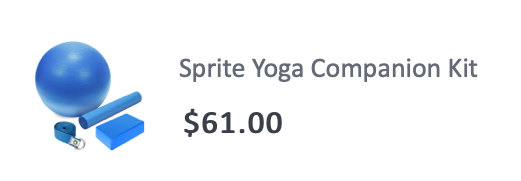

# 建立訂單確認電子郵件


| 挑戰 | 建立訂單確認異動電子郵件 |
|---|---|
| 角色 | Journey Manager |
| 所需技能 | <ul><li>[使用訊息編輯器建立電子郵件內容](https://experienceleague.adobe.com/docs/journey-optimizer-learn/tutorials/email-channel/create-content-with-the-email-designer.html?lang=zh-Hant)</li> <li>[使用內容事件資訊進行個人化](https://experienceleague.adobe.com/docs/journey-optimizer-learn/tutorials/personalize-content/use-contextual-event-information-for-personalization.html?lang=zh-Hant)</li><li>[使用協助程式功能進行個人化](https://experienceleague.adobe.com/docs/journey-optimizer-learn/tutorials/personalize-content/use-helper-functions-for-personalization.html?lang=zh-Hant)</li></ul> |
| 要下載的資產 | [訂購確認資產](/help/challenges/assets/email-assets/order-confirmation-assets.zip) |

## 故事

Luma 正在啟動其線上商店，希望在客戶下訂單後，提供訂單確認電子郵件，以保障良好的客戶體驗。


## 您的挑戰

建立歷程，當 Luma 客戶完成線上訂單時傳送訂單確認電子郵件。 

>[!BEGINTABS]

>[!TAB 工作]

1. 建立名為`Luma - Order Confirmation`的歷程
2. 使用事件： `LumaOnlinePurchase`
3. 建立稱為`Luma - Order Confirmation`的&#x200B;**異動**&#x200B;電子郵件
* 主旨列為「感謝您的購買， `FirstName`」
* 使用`Luma - Order summary`範本並加以修改：
   * 移除`You may also like`區段
   * 在電子郵件底部新增取消訂閱連結

電子郵件應有如下的結構：
<table>
<tr>
<td>
  <div>
     <strong> 標題區段</strong>
      </div>
  </td>
  <td>
      <p>
     <li>luma_logo.png</li>
    <li>應會連結到 Luma 網站：https://luma.enablementadobe.com/content/luma/us/en.html</li>
    <p>
    </td>
  </tr>
  <tr>
  <td>
  <div>
    <strong>訂購確認區段
    </strong>
  </td>
  <td>
    <p>
    <strong>文字</strong><p>
    <em>{firstName}，您好</em><p>
   <div>
    <p>
     <em>已下訂單。
    <p>您的包裹出貨後，我們會向您傳送一封包含追蹤號碼的電子郵件，供您追蹤訂單。</p></em>
    </strong>
    </tr>
  </td>
 <td>
  <div>
     <strong> 收貨區</strong>
      </div>
      <p>
      <li>名字和姓氏來自設定檔
      <li>將範本中的硬式編碼地址更換為<b>運送地址</b>
      <li>地址詳細資料是來自事件 (街道 1、城市、郵遞區號、州) 的內容屬性
      <li> 移除<i>折扣、總計、送達</i></p>
  </td>
  <td>
  <p> 收貨方：</p>
      <em>{firstName} {lastName}<br>
     {Street 1}<br>
     {City}, {State} {postalCode}<br></em></p>
  </td>
 <tr>
<td>
  <div>
     <strong>訂購詳細資料區段</strong>
      </div>
       <p><li>將此區段新增至<b>收貨方</b>區段下方。
      </p><br>
      <p><b>提示：</b>
      <li>在此區段使用結構元件<b>1:2 欄左側</b>
      <li>這是內容事件資訊。
      <li>使用 [!UICONTROL helper function]: [!UICONTROL Each]
      <li>切換至程式碼編輯器格式以新增內容資料。
  </td>
  <td>
    <strong>Header</strong>
    <p>
  訂單：<em>{purchaseOrderNumber}</em>
    </p>
    <strong>訂購的產品清單：
  </strong>
  <p>在訂單中列出每個產品，並附上影像、價格及名稱。
  <p>每個項目的版面應如下所示：
  
<p><b>將連結新增至購物車</b>
<p>將 URL 中的訂單 ID 取代為購買訂單編號：
 <i>https://luma.enablementadobe.com/content/luma/us/en/user/account/order-history/order-details.html?orderId=90845952-c2ea-4872-8466-5289183e4607</i>
</td>
  </tr>
</table>


>[!TIP]
>
>為了使您能夠對歷程進行疑難排解，最佳做法是在逾時或錯誤時向所有訊息動作新增替代路徑。

>[!TAB 成功標準]

觸發您在測試模式中建立的歷程，並傳送電子郵件給自己：

1. 在切換至測試模式之前，請先覆寫電子郵件參數以將測試電子郵件傳送至您的電子郵件地址：
   1. 開啟電子郵件詳細資料檢視。
   2. 在電子郵件參數區段，按一下 T 符號 (啟動參數覆寫
   3. 按一下「地址」欄位
   4. 在下一個畫面的運算式編輯器中，新增您的電子郵件地址：*「yourname@yourdomain」* ，並加上括弧，然後按一下「確定」。
2. 將歷程置於測試模式
3. 使用下列參數觸發事件：
   * 將設定檔識別碼設為：身分值：`a8f14eab3b483c2b96171b575ecd90b1`
   * 事件類型：commerce.purchases
   * `Quantity`: 1
   * `Price Total:` 69
   * `Purchase Order Number:` 90845952-c2ea-4872-8466-5289183e4607
   * `SKU:` LLMH09
   * `City:`San Jose
   * `Postal Code:` 95119
   * `State`: CA
   * `Street:` 245 Park Avenue

您應該會收到個人化的購買確認電子郵件。

* 主旨列應有測試設定檔的名字：Leora

* 電子郵件內容可能會以這種方式呈現：


>[!TAB 檢查您的工作]

**歷程**


**電子郵件**

**主旨列：**

感謝您的購買，{{ profile.person.name.firstName }}！

**收貨區段：**

以下是您的程式碼應呈現的外觀：

```javascript
{{ profile.person.name.firstName }} {{ profile.person.name.lastName }}
{{context.journey.events.454181416.commerce.shipping.address.street1}}
{{context.journey.events.454181416.commerce.shipping.address.city}}, {{context.journey.events.454181416.commerce.shipping.address.state}} {{context.journey.events.454181416.commerce.shipping.address.postalCode}}
```

*event.45481416* 會是另一個數字。

提示：每一列都進行個人化

**訂購詳細資料區段：**

以下是您的程式碼應呈現的外觀：

標頭:

```javascript
Order #: {{context.journey.events.1627840522.commerce.order.purchaseOrderNumber}}
```

**產品清單：**

使用協助程式函式「each」來建立產品清單。 在一個表格中顯示它們。這是程式碼的樣子 (搭配您的特定變數，例如事件 ID，而非`454181416`和組織 I 而不是`techmarketingdemos`)：

```javascript
{{#each context.journey.events.454181416.productListItems as |product|}}<tr> <th class="colspan33"><div class="acr-fragment acr-component image-container" data-component-id="image" style="width:100%;text-align:center;" contenteditable="false"><!--[if mso]><table cellpadding="0" cellspacing="0" border="0" width="100%"><tr><td style="text-align: center;" ><![endif]--><!--[if mso]></td></tr></table><![endif]--></div></th> <th class="colspan66"><div class="acr-fragment acr-component" data-component-id="text" contenteditable="false"><div class="text-container" contenteditable="true"><p><span style="font-weight:700;">{{context.journey.events.454181416.productListItems.VYG__902489191a0a40e67f51f17f3ea9e2dfaf2dea3bd0bebe8b._techmarketingdemos.product.name}}</span></p></div></div><div class="acr-fragment acr-component" data-component-id="text" contenteditable="false"><div class="text-container" contenteditable="true"><p>${{context.journey.events.454181416.productListItems.VYG__902489191a0a40e67f51f17f3ea9e2dfaf2dea3bd0bebe8b._techmarketingdemos.product.price}}.00</p></div></div></th></tr> {{/each}}
```

**檢視訂單按鈕：**

`https://luma.enablementadobe.com/content/luma/us/en/user/account/order-history/order-details.html?orderId={{context.journey.events.454181416.commerce.order.purchaseOrderNumber}}`

**總價：**

總計:`${{context.journey.events.1627840522.commerce.order.priceTotal}}.00`


>[!ENDTABS]