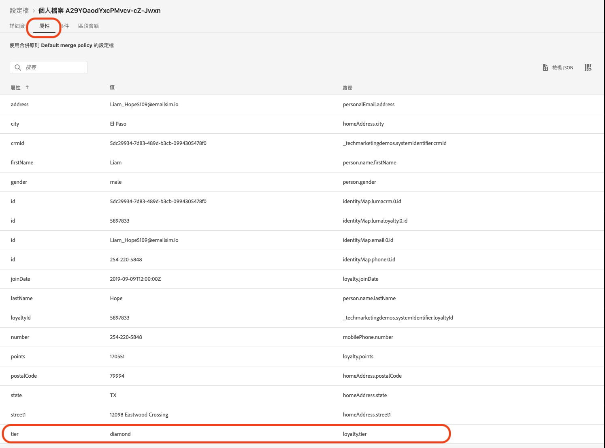
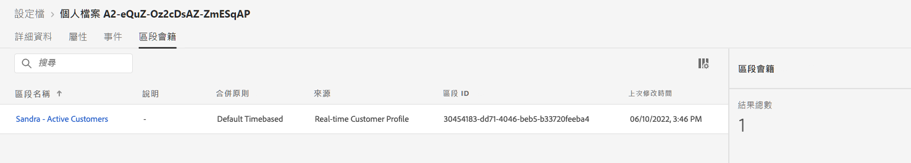

# 建立夏季系列發佈 - 挑戰


| 挑戰 | 建立夏季系列發佈 |
|---|---|
| 角色 | Journey Manager |
| 所需技能 | <ul><li>[建立區段](https://experienceleague.adobe.com/docs/journey-optimizer-learn/tutorials/profiles-segments-subscriptions/create-segments.html?lang=zh-Hant)</li><li> [匯入及編寫 HTML 電子郵件內容](https://experienceleague.adobe.com/docs/journey-optimizer-learn/tutorials/create-messages/create-emails/import-and-author-html-email-content.html?lang=zh-Hant)</li><li>[使用案例 - 讀取區段](https://experienceleague.adobe.com/docs/journey-optimizer-learn/tutorials/create-journeys/use-case-read-segment.html?lang=zh-Hant)</li> |
| 要下載的資產 | [季節性系列電子郵件檔案](/help/challenges/assets/email-assets/emails-seasonal-collection-announcement.zip) |

## 故事

虛擬的運動服裝公司 Luma 正在推廣其最新的服裝和用具系列，並努力推動現有客戶的銷售。 Luma 即將推出新的夏季系列，並且想要特別鎖定不同的客群。

## 您的挑戰

Luma 行銷團隊會要求您在 Journey Optimizer 中實施夏季系列行銷活動。 您面臨的挑戰是：

* 建立區段，定義哪些設定檔有資格接收促銷活動。
* 建立歷程.

### 步驟 1：定義區段 - 活躍客戶

>[!BEGINTABS]

>[!TAB 工作]

#### 在 [!DNL Journey Optimizer] 中建立區段。

* 在 [!DNL Journey Optimizer] 中建立稱為&#x200B;*活躍客戶*&#x200B;的區段。
* 區段必須僅包含活躍的 Luma 客戶。
* 活躍客戶是指處於 Luma 的忠誠度計畫 (銅、銀、金或白金) 某一層級中的客戶。


>[!TAB 成功標準]

在區段產生器中，您可以看到預估的合格設定檔數目。 如果您使用訓練沙箱資料，1.29 K 中有約 753 個合格設定檔。

>[!NOTE]
>由於需要回填現有設定檔，因此現有設定檔可能需要最多 24 小時才會顯示區段成員資格。

**區段已新增合格設定檔：**

您可以導覽至區段詳細資料檢視上所列之其中一個設定檔，以檢查已新增至區段的設定檔是否符合資格。

在設定檔頁面上，檢查[!UICONTROL 屬性]以確認其所符資格：層次應為銀、金、鉑或鑽石。



您也可以檢查[!UICONTROL 區段成員資格]標籤：您的區段應已列出。



>[!TAB 檢查您的工作]

區段欄位：[!UICONTROL 屬性] > [!UICONTROL XDM 個人設定檔] > [!UICONTROL 忠誠度] > [!UICONTROL 層級]

區段可能會以這種方式呈現：


程式碼應如下所示：

```javascript
stringCompare("equals", loyalty.tier, ["diamond", "gold", "platinum", "silver"], false)
```

>[!ENDTABS]


### 步驟 2：建立歷程 - 夏季系列發佈

>[!BEGINTABS]

>[!TAB 工作]

#### 傳送夏季系列發佈

一家機構向您提供了四份 HTML 檔案，其中包含電子郵件的設計：

* `SeasonalCollectionEmail.html`
* Luma 男士系列電子郵件
* Luma 女士系列電子郵件
* Luma - 八折系列電子郵件

1. [下載季節性系列電子郵件檔案](/help/challenges/assets/email-assets/emails-seasonal-collection-announcement.zip)。

2. 根據下列准則，建立名為 *Luma - 夏季系列發佈*&#x200B;歷程 ：

   1. 傳送 *Luma - 全新夏季系列發佈*&#x200B;電子郵件至&#x200B;*活躍客戶*&#x200B;區段，將 10% 的對象視為控制組
      * 訊息標題 *Luma - 夏季系列發佈*
      * 主旨列 *(收件者的名字)，新的 Luma 夏季系列已推出！*
      * 使用提供的 HTML 檔案 `SeasonalCollectionEmail.html` 用於電子郵件內文。
   2. 等候兩天，然後傳送後續電子郵件訊息，其中包含更具針對性的內容：
      * 男性客戶應接收 **Luma 男士系列**&#x200B;電子郵件。
         * 訊息標題：*Luma 男士系列*
         * 主旨列：*(收件者的名字)，探索男士新運動用具！*
         * 電子郵件內文：`MensCollectionEmail.html` 用於電子郵件內文。
      * 女性客戶應收到 **Luma 女士系列**&#x200B;電子郵件。
         * 訊息標題：*Luma 女士系列*
         * 主旨列：*(收件者的名字)，探索 Luma 女士系列！*
         * 電子郵件內文：`WomensCollectionEmail.html`
      * 其他客戶應收到 **Luma - 八折系列**&#x200B;電子郵件。
         * 訊息標題： *Luma - 八折系列*
         * 主旨列： *(收件者的名字)，享受八折優惠！*
         * 電子郵件內文：`20OOffCollectionEmail.html`
   3. 在上方傳送目標電子郵件後，請等待兩天再開啟電子郵件
   4. 如果目標電子郵件未在兩天內開啟，請傳送 **Luma - 八折系列電子郵件**&#x200B;作為最終的重新定位嘗試


>[!TAB 成功標準]

#### 預覽電子郵件

**電子郵件訊息 #1 - Luma - 夏季系列發佈**

預覽電子郵件：

1. 新增測試設定檔：Louise Petti：
   1. 身分命名空間： *Luma CRM ID*
   2. 身分值： *d1f132f9f9502bba047a6ec86c4b61f9*

結果:
* 主旨列應為：Louise，新的 Luma 系列已推出！
* 電子郵件內文應與您在預覽中看到的內容相符：[新的季節性系列發佈](/help/challenges/assets/email-assets/SeasonalCollectionEmail.html)


**電子郵件 #2 - Luma 男士系列**

向自己傳送一份證明：

1. 新增測試設定檔：Stanleigh Stooke：
   1. 身分命名空間：*Luma CRM ID*
   1. 身分值：`4f34057d9d9e792c28ba18ecae378e98`
1. 選取測試設定檔：Stanleigh Stooke。
1. 向自己傳送一份證明。

結果:\
您應會收到電子郵件。 主旨列應為 *Stanleigh，探索男士新運動用具！* 和電子郵件內文應與您在預覽中看到的內容相符：[Luma 男士系列](/help/challenges/assets/email-assets/MensCollectionEmail.html)

>[!NOTE]
>你可能需要幾分鐘才能收到證明。

**電子郵件 #3 - Luma 女士系列**

使用測試設定檔預覽電子郵件 *Louise Petti。*

* 主旨列應為： *Louise，探索 Luma 女士系列！*
* 電子郵件內文應與您在預覽中看到的內容相符： [Luma 女士系列](/help/challenges/assets/email-assets/WomensCollectionEmail.html)


**電子郵件訊息 #4 - Luma 八折系列**

使用測試設定檔預覽電子郵件 *Louise Petti。*

* 主旨列應為： *Louise，享受八折優惠！*
* 電子郵件內文應與您在預覽中看到的內容相符： [Luma 八折系列](/help/challenges/assets/email-assets/20OOffCollectionEmail.html)


#### 測試您的歷程

>[!IMPORTANT]
>
>將歷程設定至測試模式之前：
>
>1. 請確定[!UICONTROL 閱讀區段活動]命名空間已設為 **Luma CRM id(lumaCrmId)**
>1. 對於每封電子郵件，覆寫電子郵件的預設電子郵件參數，以便將其傳送至您的電子郵件地址：
>    * 按一下眼睛符號來顯示隱藏的值。
>    * 在電子郵件參數中，按一下 T 符號 (啟用參數覆寫)。
>
>      
> 
>    * 按一下[!UICONTROL 地址]欄位
>    * 在下一個畫面中，以括弧新增您的電子郵件地址：運算式編輯器中的`"yourname@yourdomain"`，按一下「確定」。
>


測試歷程，並將電子郵件傳送至您自己的帳戶：

1. 將歷程置於測試模式。
1. 選取&#x200B;**[!UICONTROL 一次單個設定檔]**。
1. 等待時間：將計時器設為120秒 (在欄位中輸入)。
1. 觸發設定檔入口
1. 您可以使用以下 *Luma CRM Ids* 作為設定檔識別碼來測試每個分支：
   * 女性：Leora Dietsche，身分值：`a8f14eab3b483c2b96171b575ecd90b1`
   * 男性：Stanleigh Stooke，身分值： `4f34057d9d9e792c28ba18ecae378e98`
   * 未指定性別：Louise Petti，身分值： `d1f132f9f9502bba047a6ec86c4b61f9`

1. 觸發設定檔入口後，您應會收到第一封電子郵件。 標題應根據您選取的設定檔進行個人化設定。
1. 歷程應繼續進入個別分支，您應會收到相關電子郵件 (例如，如果您選擇 *Jenna*，您應會收到 *Luma 女士系列* 電子郵件)。
1. 開啟第二封電子郵件，歷程應該會結束。
1. 您可以重複步驟 4。 - 7. 對於全部三個設定檔，以檢查分支是否正常運作。
1. 若要測試逾時，請將等待時間設為 30 秒，然後再次觸發項目。
1. 請勿開啟您收到的電子郵件 (請勿預覽電子郵件 (!)) 讓等待時間過去。

您應會收到下列電子郵件：

* Luma - 新的季節性系列公告
* 根據您使用的測試設定檔，您應會收到下列其中一封電子郵件：
   * Leora：Luma 女士系列
   * Stanleigh：Luma 男士系列
   * Louise：Luma — 精選系列八折
* 如果您未開啟第二封電子郵件：Luma — 精選系列八折

>[!TAB 檢查您的工作]

以下是您歷程的外觀：


**條件 - 控制組：**


**條件 - 性別：**\


>[!ENDTABS]
