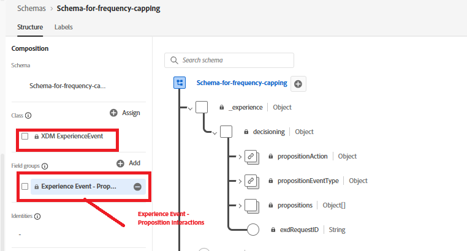
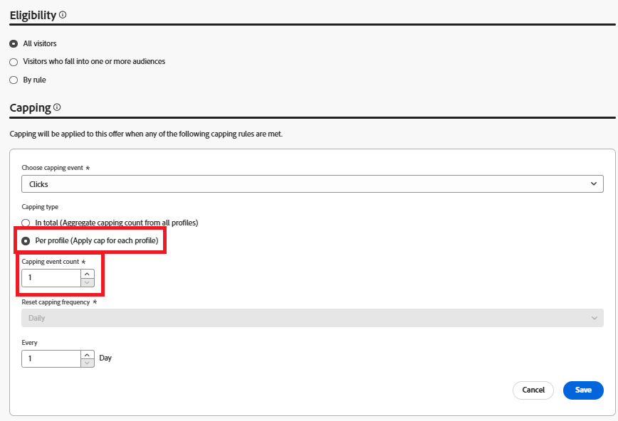
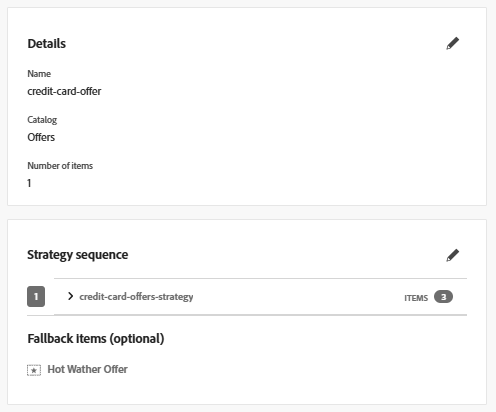
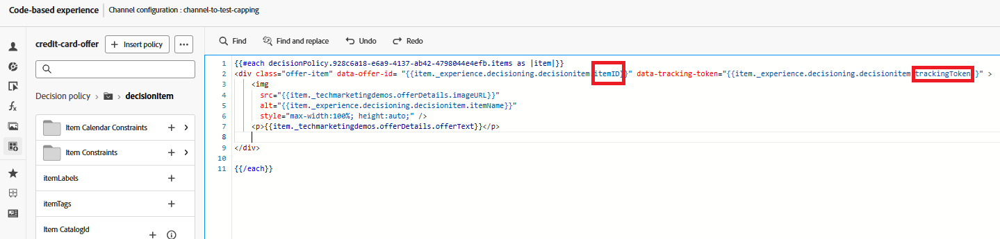

# 為AJO行銷活動啟用頻率限定

若要套用頻率限定至選件，請完成下列步驟：

## 更新事件結構描述

* 新增欄位群組以更新現有的事件結構，如圖所示
* 

## 更新優惠方案的頻率限定

* 

## 將追蹤權杖新增至選件

新增遞補優惠以編輯行銷活動中使用的決定原則

若要新增trackingToken和ItemID，請按一下左側導覽的「決定原則」圖示，然後向下展開決定樹狀結構以選取itemID和trackingToken。

將專案id和追蹤Token新增至包含選件的div，如下所示

這可確保每個演算後的選件都包含資料追蹤代號，這對於精確曝光和點選事件追蹤至關重要。

啟用修改後的行銷活動。

## 傳送曝光和追蹤事件

修改現有的JavaScript程式碼，以使用Adobe Web SDK擷取優惠閱聽和互動事件並傳送至Adobe Experience Platform。 請參閱此處提供的[範常式式碼。](capture-impression-click-events.md)

