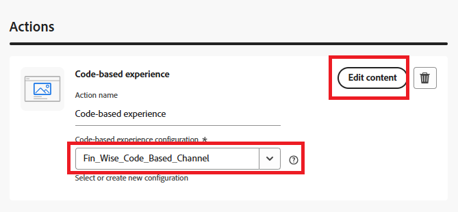

# 建立行銷活動

在Adobe Journey Optimizer (AJO)中，行銷活動會作為容器，將傳送個人化體驗給目標對象所需的所有元素彙整在一起。 它協調優惠何時顯示、如何顯示，以及連結管道、位置、集合和決定策略等元件。

* 登入Journey Optimizer
* 歷程管理 — >行銷活動 — >建立行銷活動 — >排程行銷
* 請務必選取程式碼型體驗動作，並選取在上一步中建立的設定。
  
* 按一下「編輯內容」，然後按一下「編輯程式碼」以開啟個人化編輯器。這是允許您編寫程式碼的非視覺化體驗建立介面
  

