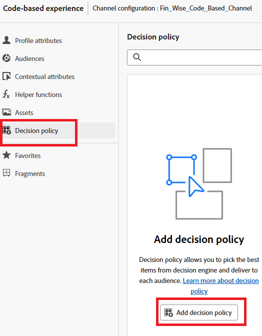

# 建立決定原則

決策原則是優惠方案的容器，可運用決策引擎，根據對象挑選最佳內容進行傳遞。

在個人化編輯器中，按一下左側導覽中的決定原則專案，然後按一下新增決定原則

按一下新增以選取選取策略
按一下選取遞補內容，即可選取遞補內容。
按一下「下一步」以檢閱決定原則，然後按一下「建立」以完成建立決定原則的程式。

## 在程式碼編輯器中使用決定原則

在個人化編輯器中，按一下「插入原則」。會新增與決定原則對應的代碼。

在此階段，您可以直接在程式碼中包含任何必要的決定屬性。 這些屬性是在優惠方案目錄使用的結構描述中定義。 標準屬性是以__experience名稱空間進行組織，而貴組織專屬的任何自訂屬性都會儲存在`_<imsOrg>`名稱空間下。

此程式碼會瀏覽為使用者選擇的個人化優惠清單，並在網頁上顯示每個優惠的文字。 它會顯示段落內每個選件的訊息（稱為offerText），讓使用者可以清楚看到其自訂內容。
如果沒有可用的個人化優惠方案，則會顯示遞補優惠方案，以確保空間不會留空。

按一下儲存，然後啟動行銷活動