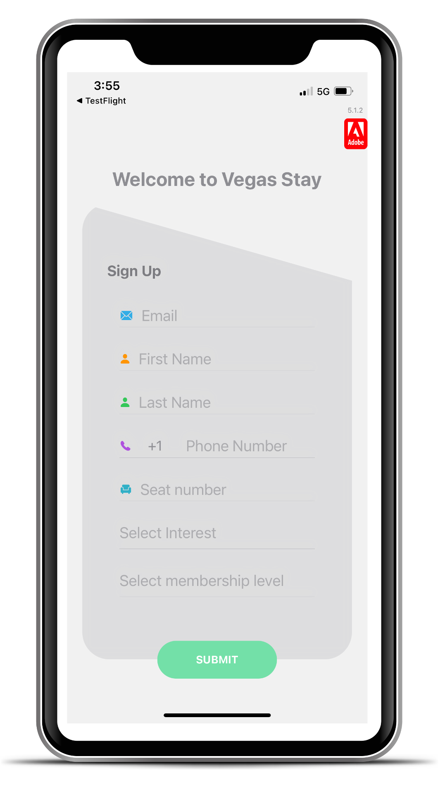

# 練習 1.2：註冊為應用程式使用者

>[!IMPORTANT]
>請透過&#x200B;**您可在實驗室工作階段期間存取的電子郵件地址**&#x200B;和&#x200B;**您的行動電話號碼**&#x200B;進行註冊。
>
> 若要接收準備傳送的訊息，需要提供此資訊。 也可讓您存取 Journey Optimizer 中的資訊。 除本實驗外，將不會用於任何用途。

1. 開啟應用程式。
1. 在快顯視窗中，按一下「允許」 。
1. 註冊：

   於第一次開啟應用程式時，系統會要求您註冊。 請輸入以下詳細資訊：

   <table>
    <tr>
    <td>
    

     
    

    </td>
    <td>
    <strong>電子郵件： </strong> 輸入您可在實驗期間存取的電子郵件地址。
    

    <strong>名字與姓氏</strong>
    

    <strong>電話號碼：</strong> 使用以下格式輸入您的行動電話號碼： 
    
+16501245566（+國家/地區代碼，電話號碼）。
    

    <strong>座號：</strong> 工作站座位號碼。 輸入正確的座號非常重要！
    

    <strong>選擇興趣： </strong> 運動、健康、餐飲或娛樂
    

    <strong>選擇會員資格等級： </strong> 紅、藍、綠或黃

    </td>
    </tr>
    </table>

1. 按一下&#x200B;**提交**

>[!SUCCESS]
>
>您已建立應用程式使用者，且已在 Adobe Journey Optimizer 中建立此使用者的設定檔。
