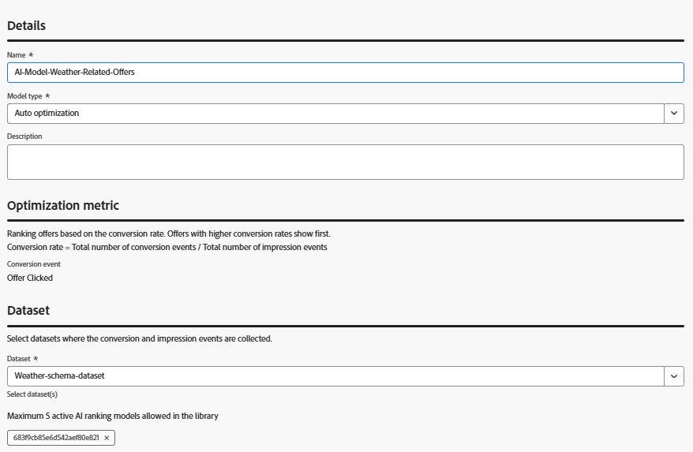
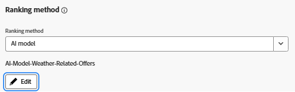

# 使用Adobe Web SDK擷取優惠方案互動，以進行AI模型訓練

>[!NOTE]
>
> 只有在您打算在Adobe Journey Optimizer中使用AI型排名方法，以根據預測參與來個人化顯示哪個優惠時，才能完成本文。


本文示範如何透過直接在Adobe Experience Platform程式碼中呼叫alloy(&quot;sendEvent&quot; ...)，使用JavaScript Web SDK擷取優惠方案互動事件（例如曝光數或點按數）。 資料會內嵌至AEP，並用於在Adobe Journey Optimizer (AJO)中訓練AI模型，以根據即時行為更聰明地排名選件。

若要在Adobe Journey Optimizer中建立優惠方案排名的AI模型，您的資料集必須根據包含主張互動欄位群組的結構描述。 此欄位群組支援decisioning.propositionDisplay和decisioning.propositionInteract等關鍵決策事件，以及invessedPropositions、display和interact等必要欄位。

有兩個有效的方法可達成此目的：

- 建立專門針對互動追蹤設定的新結構、資料集和資料流
- 更新現有結構 — 這正是本教學課程中的內容


## 更新現有結構描述以擷取選件互動事件

用於天氣相關優惠方案的現有Experience Event方案已更新，不再建立新方案以支援互動追蹤。

在Adobe Experience Platform中：

- 開啟您用於天氣型優惠方案的現有&#x200B;_&#x200B;**天氣結構描述**&#x200B;_&#x200B;體驗事件結構描述。

- 新增欄位群組：
體驗事件 — 主張互動

您不需要建立新的資料集或資料流 — 繼續使用您現有的天氣選件設定。 傳送的事件符合Adobe Journey Optimizer對訓練AI模型和追蹤選件效能的期望。


繼續使用目前的資料集（不需要建立新的資料集）

現有的資料流已設定完畢，並在Adobe Experience Platform Tags屬性中使用 — 無需變更。

Web SDK會自動將新的互動事件路由到正確的目的地。

這種簡化的設定確保所有決策和天氣事件都內嵌到單一、統一的資料集中，最適合在Adobe Journey Optimizer中訓練AI模型。


## 擷取選件顯示事件（曝光數）

優惠方案的HTML結構已修改為包含互動式元素 — 尤其是`<a>`和`<button>`標籤 — 可讓使用者參與優惠方案（例如「宣告優惠方案」或「深入瞭解」按鈕）。

每個按鈕都包含data-offer-id屬性，因此可正確追蹤對應的互動。


為了記錄何時向使用者顯示選件，用於呈現天氣選件的現有JavaScript檔案已更新，以包含顯示事件追蹤。

現在，當顯示一或多個選件時，會使用Adobe Web SDK (alloy.sendEvent)傳送decisioning.propositionDisplay事件。 此事件包含必要的顯示： 1個旗標並參考相關主張。


```javascript
if (offerIds.length > 0) {
  alloy("sendEvent", {
    xdm: {
      _id: generateUUID(),
      timestamp: new Date().toISOString(),
      eventType: "decisioning.propositionDisplay",
      _experience: {
        decisioning: {
          propositionEvent: {
            display: 1
          },
          involvedPropositions: offerIds.map(id => ({
            id,
            scope: "web://gbedekar489.github.io/weather/weather-offers.html#offerContainer"
          }))
        }
      }
    }
  });
}
```

## 擷取選件點按事件（互動）

為了追蹤使用者何時點按優惠方案，我們已更新現有的JavaScript，以接聽對優惠方案容器內轉譯的`<a>`和`<button>`元素的點按。

偵測到點選時，會使用Adobe Web SDK傳送decisioning.propositionInteract事件。 事件包含必要的互動： 1個旗標，並參考特定優惠方案ID和決定範圍。

```javascript
// Attach click tracking to <a> and <button> elements
wrapper.querySelectorAll("a, button").forEach(el => {
  el.addEventListener("click", () => {
    const offerId = el.getAttribute("data-offer-id") || item.id;
    console.log("Clicked element offerId:", offerId);

    alloy("sendEvent", {
      xdm: {
        _id: generateUUID(),
        timestamp: new Date().toISOString(),
        eventType: "decisioning.propositionInteract",
        _experience: {
          decisioning: {
            propositionEvent: {
              interact: 1
            },
            involvedPropositions: [{
              id: offerId,
              scope: "web://gbedekar489.github.io/weather/weather-offers.html#offerContainer"
            }]
          }
        }
      }
    });
  });
});
```

## 在Adobe Journey Optimizer Offer Decisioning中建立優惠方案排名的AI模型

有了，現在可透過網路SDK擷取並儲存在Adobe Experience Platform中的優惠閱聽和點按，此資料可用來訓練AI模型，預測哪些優惠最有可能促進參與。

此AI模型可在排名公式或選擇策略中參照，以決定每個使用者優先處理哪些選件。
- 登入Journey Optimizer
- 導覽至「決策 — >策略設定 — > AI模型 — >建立AI模型」
- 請確定使用正確的資料集
  
- 儲存並啟動AI模型。
- 更新在先前步驟中建立的選取策略，以便將AI模型用於Ranking方法
  

## 測試解決方案

將[更新的JavaScript檔案](assets/ai-model.js)包含在[現有網頁](assets/weather-offers.html)中