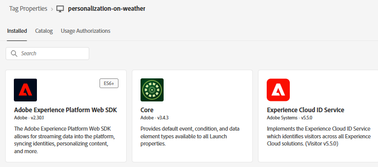
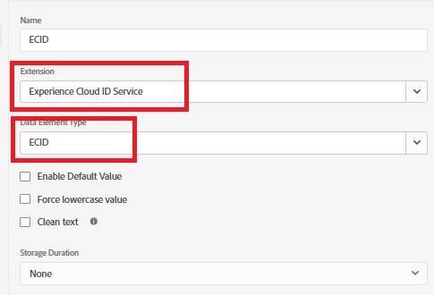
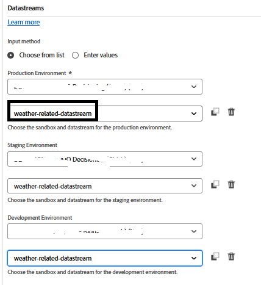
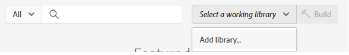
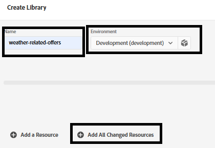

# 建立Adobe Experience Platform標籤

Adobe Experience Platform Tags (先前稱為Adobe Launch)有助於在網站上管理和部署*行銷與分析技術，而不需要變更網站的程式碼。

此[影片說明建立Adobe Experience Tags的程式](https://experienceleague.adobe.com/en/playlists/experience-platform-get-started-with-tags)

- 登入資料收集
- 按一下&#x200B;_**標籤 — >新增屬性**_

- 建立名為&#x200B;_**personalization-on-weather**_&#x200B;的Adobe Experience Platform標籤。

- 將下列擴充功能新增至標籤
  
- 新增名為「ECID」的資料元素，如下所示。 此資料元素稍後會在報表中使用
  

- 請務必設定Adobe Experience Platform Web SDK以使用先前的步驟中所建立的正確環境和&#x200B;**天氣相關資料流**。
  


## 建置和部署AEP標籤


建立新程式庫，並將所有已修改的資源新增至程式庫，如下面的熒幕擷取畫面所示。

**新增資料庫**



**建立資料庫**

在「建立程式庫」畫面中，指定程式庫名稱和環境。

將所有變更的資源新增至此程式庫


然後按一下儲存並建置到開發按鈕以建置程式庫

## 在HTML頁面中加入AEP標籤

當您發佈AEP Tags屬性時，Adobe會為您提供指令碼標籤，您必須將該標籤置於HTML ``` <head>```內或``` <body>```標籤的底部。

- 前往Tags(personalization-on-weather)屬性。

- 按一下環境，然後按一下所需環境的安裝圖示（例如開發、測試、生產）。

- 記下內嵌程式碼。 在本教學課程的稍後階段會用到它。
