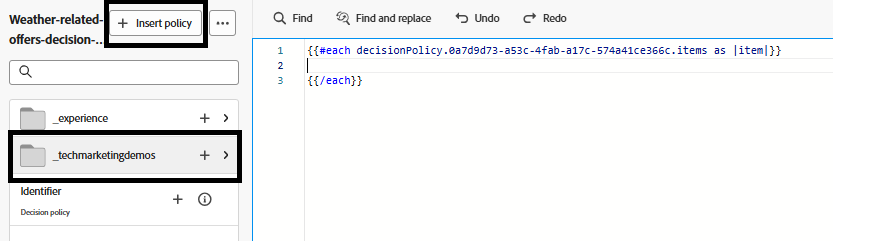
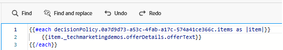

# 建立行銷活動

為了透過網頁為使用者提供個人化優惠方案，已在Adobe Journey Optimizer中建立行銷活動，並設定正確的管道、程式碼型體驗管道。 此設定可確保透過即時決策將優惠提供給與網站互動的使用者。

在此行銷活動中，已定義決定原則來控制如何選取優惠。 決策原則包含選擇策略，該策略包含：

- 優惠專案的集合（例如，根據天氣相關標籤），
- 決定哪些優惠方案適用於使用者的適用性規則，以及
- 一種排名公式，可將分數指派給合格的優惠方案，以排定最相關優惠方案的優先順序。

當使用者造訪網站時，系統會偵測其位置並使用天氣API擷取目前溫度。 然後，這些溫度資料會透過網頁SDK (Alloy)傳送至Adobe Experience Platform。 Adobe Journey Optimizer會根據此即時情境資料，評估已針對特定天氣條件（例如熱、溫和或冷）標籤的預定義選件。 使用選取策略和排名公式的最相關優惠方案，會使用Adobe的決策引擎自動在網頁上轉譯，確保使用者收到符合其所在區域目前天氣的個人化內容。

## 在AJO中建立行銷活動的高階步驟

- 建立管道設定
   - 定義選件的顯示位置及方式（例如具有程式碼型體驗的網頁）。
   - 登入Journey Optimizer
   - 瀏覽至&#x200B;_&#x200B;**管理 — >管道 — >建立管道設定**&#x200B;_
   - **名稱**： `offers-by-weather`\
     識別此設定以進行個人化Web選件傳遞。
- **頻道**：
  `Code-based experience`\
  選件不會直接插入至DOM。 AJO而是會傳回原始HTML，並使用自訂JavaScript進行剖析。
- **平台**： `Web`\
  專門針對網頁瀏覽器。 未啟用任何行動裝置頻道。

- **頁面URL**： `https://gbedekar489.github.io/weather/weather-offers.html`\
  此管道針對開發期間使用的特定測試頁面進行設定。
- **在頁面**&#x200B;上的位置： `offerContainer`\
  系統使用前端邏輯動態剖析傳回的選件，並將其演算至此容器。

- **內容格式**： `HTML`\
  選件會以原始HTML片段傳送，以便完整控制選件的樣式、篩選和顯示方式。

- **開始新的行銷活動**
   - 導覽至「行銷活動」區段，並建立新的排程行銷活動。 為行銷活動適當命名。
   - **新增動作**
      - 新增程式碼型體驗動作，並將動作連結至先前建立的通道設定。

   - **客群**
      - 所有訪客（預設）。
      - 身分型別：ECID (Experience Cloud ID)
此設定使用ECID作為主要身分來辨識使用者。

- **建立決定原則**
   - 此動作連結至&#x200B;**決定原則**，該原則定義如何選取優惠以及傳回多少優惠以供顯示。 此原則使用先前在教學課程中建立的&#x200B;**選取策略**。
   - 若要插入決定原則，請按一下[動作]區段中的[編輯內容] **__**，然後按一下[編輯程式碼] **__**&#x200B;以開啟個人化編輯器。
   - 選取左側的&#x200B;_&#x200B;**決定原則**&#x200B;_&#x200B;圖示，然後按一下&#x200B;**新增決定原則**&#x200B;按鈕以開啟&#x200B;**建立決定原則**&#x200B;畫面。 為決定原則提供有意義的名稱，並選取決定原則應傳回的專案數。 預設值為1。
   - 按一下&#x200B;**_下一步_**，並將先前步驟中建立的選擇策略新增至決定原則，然後按一下&#x200B;**下一步**&#x200B;以完成建立決定原則的程式。 沒有與決定原則關聯的遞補優惠。

- **插入決定原則**
  

  按一下&#x200B;_&#x200B;**插入原則**&#x200B;_按鈕，插入新建立的決定原則。 這會在右側的個人化編輯器中插入for回圈。
將游標放在每個回圈之間的第二行，並透過向下鑽研`tenant name`來瀏覽至選件以插入offerText

  Handlebars程式碼會循環Adobe Journey Optimizer中特定決定原則傳回的優惠。
  

- **發佈行銷活動**\
  啟動行銷活動，開始即時提供個人化優惠。
