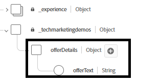

# 建立優惠方案以測試動態決策和排名

這些選件旨在根據透過Adobe Web SDK (alloy(「sendEvent」))傳遞的即時情境輸入（例如溫度），測試動態決策和排名。

建立優惠方案之前，優惠方案專案結構描述已擴充以包含新欄位： offerText

。

建立下列3個選件


## 熱天氣選件（標籤:hot）

炎熱天氣選件的選件文字

```html
<div data-tags="weather hot skincare sunscreen" style="border: 1px solid #e0e0e0; padding: 1.5rem; border-radius: 10px; background-color: #fff3e0;">   <h2 style="color: #e65100;">Protect Your Skin This Summer</h2>   <p>High temperatures mean high UV risk. Get <strong>20% off</strong> our dermatologist-recommended sunscreens and skin protection kits.</p>   <p>Offer valid this week only for areas with temperatures over 90°F.</p> <button  class="ajo-cta"> Shop Sunscreen</button>   </div>
```


## 輕度天氣選件（標籤:spring）

輕度天氣的優惠方案文字

```html
<div class="offer-content" style="text-align: center; padding: 1rem;">      <h2>Grow More Than Just Flowers 🌿</h2>   <p>     Spring is here, and it's the perfect time to cultivate your garden — and your savings!     Enjoy <strong>$50 off</strong> when you spend $250 or more on gardening tools, seeds, and accessories.   </p>   <p><strong>Promo Code:</strong> <code>GROWSPRING</code></p>   <p><em>Offer valid through May 31. Let your garden — and your wallet — thrive.</em></p> <button  class="ajo-cta"> YES,I want this offer</button> </div>
```

## 冷天氣（標籤:cold）

寒冷天氣優惠方案的優惠方案文字

```html
<div class="offer-content" style="text-align: center; padding: 1rem;">      <h2>Cold Weather, Hot Deals 🧤</h2>   <p>Stay warm in style with our exclusive <strong>25% off</strong> winter outerwear. From puffer jackets to wool scarves, find the perfect layers to beat the chill.</p>   <p><strong>Use code:</strong> <code>WINTER25</code> at checkout</p>   <p><em>Limited time offer. While supplies last.</em></p><button  class="ajo-cta"> Shop Sunscreen</button> </div>
```

### 建立集合

瀏覽至&#x200B;**_決策 — >目錄 — >集合 — >建立集合_**
為集合&#x200B;**天氣相關優惠**&#x200B;命名

使用規則產生器將這個集合中的這些優惠方案分組。

