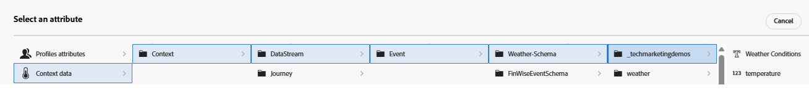

# 建立排名公式

Adobe Journey Optimizer中的排名公式會在Offer Decisioning期間使用，尤其是在選取策略中，用來決定合格優惠方案的優先順序。 適用性篩選之後，排名公式就會開始起作用，當多個優惠符合指定設定檔的資格時，但應根據商業邏輯或設定檔內容只顯示前一個（或少數個）。

* 登入Journey Optimizer

* 決策 — >策略設定 — >排名公式 — >建立公式

為公式&#x200B;_**命名Weather - Related - Offers**_

排名公式中的條件是指用於將分數指派給優惠方案的條件規則。 這些條件會比較優惠方案和內容的屬性，以判斷優惠方案與特定個人的相關性。

定義下列3個條件來篩選優惠方案，然後將排名分數指派給合格優惠方案。 條件是使用條件產生器定義。 內容資料也可用於定義條件，如下方熒幕擷圖所示

所有3個條件都使用選件屬性（標籤）和內容資料屬性（溫度）來定義條件。

## 條件一

| **選件標籤** | **內容資料條件** | **分數邏輯** |
|------------------|---------------------|-------------------------------------|
| **熱** | 溫度> 80 | score=溫度 |

## 條件二

| **天氣標籤** | **內容資料條件** | **分數邏輯** |
|------------------|---------------------------|----------------------------------------------|
| **春季** | 溫度> 65且&lt; 80 | score=temperate × 4 |

## 條件三

| **天氣標籤** | **內容資料條件** | **分數邏輯** |
|------------------|---------------------------|----------------------------------------------|
| **冷** | 溫度&lt; 65 | score =溫度 |
