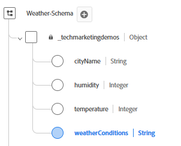
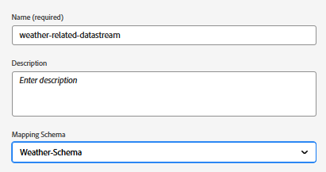
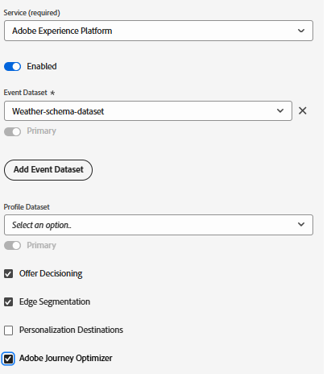

# 在AEP中設定XDM結構、資料集和資料流

## 建立XDM結構描述

若要在網頁上使用Adobe Experience Platform網頁SDK (Alloy.js)，AEP標籤必須與對應至XDM事件結構的資料流相關聯。 網頁SDK (alloy.sendEvent)會將資料以Experience Event的形式傳送至AEP，而後者必須根據XDM ExperienceEvent類別符合XDM結構描述。

建立XDM結構描述

- 登入Adobe Experience Platform
- 瀏覽至&#x200B;_**資料管理 — >結構描述 — >建立結構描述**_

- 建立名為&#x200B;**_天氣結構描述_**&#x200B;的XDM事件型結構描述。 如果您不熟悉建立結構描述，請依照此[檔案](https://experienceleague.adobe.com/en/docs/experience-platform/xdm/tutorials/create-schema-ui)操作

- 請確定結構描述有下列具有適當資料型別的欄位。

- 

- 將欄位群組&#x200B;_**Web詳細資料**_&#x200B;新增到結構描述。 此欄位群組是進行報告的必要專案。

## 根據結構建立資料集

Adobe Experience Platform (AEP)**中的**&#x200B;資料集是結構化儲存容器，用來根據定義的XDM結構描述擷取、儲存及啟用資料。

- 導覽至&#x200B;_**資料管理 — >資料集 — >建立資料集**_
- 根據上一步建立的XDM結構描述（**_天氣結構描述_**），建立名為&#x200B;_**天氣結構描述資料集**_&#x200B;的資料集。

## 建立資料串流

Adobe Experience Platform中的資料串流就像將您的網站或應用程式連線到Adobe服務的安全管道（或高速公路），可讓資料流入，而個人化內容流回。

- 導覽至&#x200B;_**資料收集>資料串流**_，然後按一下[新增資料串流]。 命名資料串流&#x200B;**天氣相關資料串流**

- 提供下列詳細資訊，如下方熒幕擷圖所示
  
- 按一下儲存，然後按一下新增對應並新增Adobe Experience Platform服務和事件資料集，並選取適當的核取方塊
  

- 儲存資料串流。
