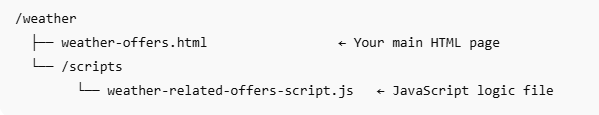

# 測試解決方案

若要端對端測試解決方案，[weather-offers.html](assets/weather-offers.html)和[weather-related-offers-script.js](assets/weather-related-offers-script.js)檔案必須託管在Web伺服器或公用託管服務（例如Github Pages）上。 這是必要的，因為：
 — 瀏覽器的地理位置API僅適用於HTTPS或localhost

若要讓專案維持井然有序，並確保相對路徑正常運作，我們建議使用下列檔案夾結構來託管解決方案：



## 下載提供的檔案

[HTML檔案](assets/weather-offers.html)

[Javascript檔案](assets/weather-related-offers-script.js)


## 更新javascript檔案中的表面URL

開啟`weather-related-offers-script.js`並更新` "web://yourdomain.com/weather/weather-offers.html#offerContainer"`bt，將`yourdomain.com`取代為託管HTML檔案的實際網域。

## 更新Adobe Experience Platform標籤屬性

在文字編輯器中開啟weather-offers.html檔案，並將指令碼標籤取代為Adobe Experience Platform標籤屬性的指令碼標籤（於本教學課程的前一步中建立）。 請務必儲存檔案

```
<script src="https://assets.adobedtm.com/AEM_TAGS/launch-ENabcd1234.min.js" async></script>
```


## 網頁的作用

系統會建立網頁，以使用即時溫度資料測試情境式選件個人化。 當使用者造訪頁面時，瀏覽器會提示您提供地理位置存取許可權。 核准後，頁面會透過OpenWeatherMap API擷取目前的天氣詳細資料，例如溫度、狀況和城市。 系統會使用Adobe Web SDK (Alloy)，將此內容資料顯示給使用者並傳送至Adobe Experience Platform。

sendEvent呼叫是以renderDecisions： false設定，這表示Adobe Journey Optimizer傳回的選件會手動處理。 指令碼會處理決策回應、解碼內容，並將最相關的選件動態插入指定容器(#offerContainer)。

## JavaScript的作用

JavaScript會根據使用者的位置動態擷取天氣資訊，並使用Adobe Experience Platform (AEP)來提供個人化優惠。 以下是步驟的劃分：

1. **等待Alloy載入**

   指令碼可確保Adobe Web SDK (Alloy)完全載入，然後再提出任何個人化請求。

2. **取得使用者的位置**

   它會使用瀏覽器的地理位置API來擷取使用者目前的經緯度。

3. **擷取天氣資料**

   它會呼叫OpenWeatherMap API來取得目前的天氣詳細資料：

   溫度（華氏）

   天氣條件（例如：「下雨」、「晴」）

   城市名稱

   濕度

4. **在網頁上顯示天氣資訊**

   使用如下訊息更新DOM：

   「聖地亞哥目前的氣溫是華氏72度，晴天。」

5. **傳送天氣內容至AEP**

   使用alloy(&quot;sendEvent&quot;)將內容相關的天氣資料傳送至AEP

   ```javascript
   xdm: {
   eventType: "decisioning.request",
   _techmarketingdemos: {
   temperature: temp,
   weatherConditions: condition,
   cityName: city
     }
   }
   ```

6. **擷取並轉譯選件**

   接收AJO Decisioning傳回的選件。

   解碼HTML內容。

   以動態方式將選件插入 <div id="offerContainer"> 元素。

## 後續步驟

[測量並報告AJO Decisioning的影響。](https://experienceleague.adobe.com/zh-hant/docs/journey-optimizer-learn/reporting-on-ajo-od/introduction)

