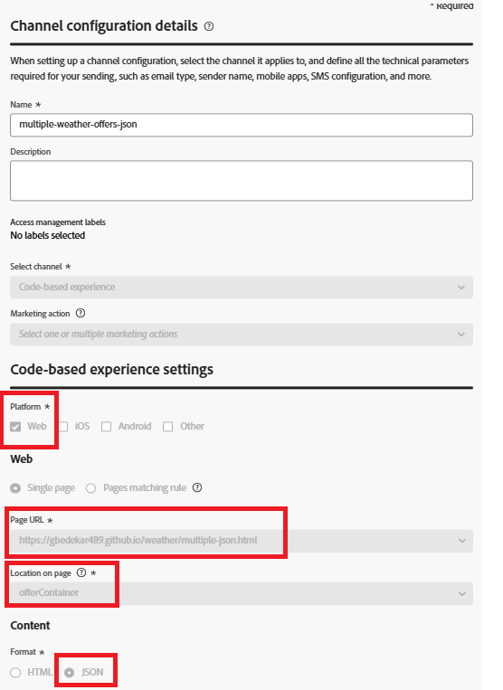
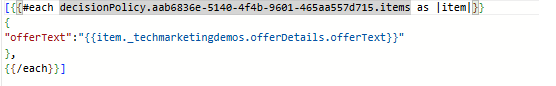

# 在Adobe Journey Optimizer中使用JSON內容傳遞Personalization

此區段作為進階使用者的額外資源提供，這些使用者想要更深入控制優惠方案在前端上的呈現方式。

在程式碼型體驗(CBE)中使用JSON內容型別，可讓您傳回結構化選件資料，並使用JavaScript動態處理轉譯。 JSON內容型別對於需要自訂版面、條件式邏輯或與情境資料（例如天氣、位置或裝置型別）整合的情境特別有用。

雖然基本選件傳送不需要此專案，但此方法可讓開發人員建立超越標準HTML演算功能的個人化資料導向體驗，並擁有彈性。

## 建立具有JSON內容型別的程式碼型體驗(CBE)。

首先，在Adobe Journey Optimizer中建立新的程式碼型體驗(CBE)，並將內容格式設定為JSON。 內容型別會指示AJO將結構化選件資料（例如offerText、影像或中繼資料）傳回為JSON物件，而非轉譯的HTML。 定義平台（例如Web）、選件出現的目標URL以及頁面上的位置（例如offerContainer之類的容器ID）。 此設定可讓您的網頁應用程式接收選件資料，並使用JavaScript動態轉譯資料。



## 將CBE與行銷活動與決定原則建立關聯

具有JSON內容型別的程式碼型體驗(CBE)建立後，會透過決定原則連結至行銷活動。 決策政策會根據設定檔或內容資料，定義優惠資格、排名和傳送的邏輯。

將決定原則插入Personalization編輯器時（例如，針對應用程式內訊息或電子郵件），請務必確保輸出維持有效的JSON結構。

當您將決定原則插入行銷活動中的Personalization編輯器(PE)時，Adobe Journey Optimizer會根據選取的原則自動產生Handlebars回圈。 例如：

此回圈會反複執行原則傳回的所有決定專案，並從每個優惠方案中插入offerText欄位。 此預設結構非常適用於HTML內容型別，但在使用JSON內容時，可能需要重新調整以產生有效的JSON陣列或物件，尤其是在以程式設計方式剖析結果的情況下。



此Handlebars範本旨在輸出選件物件的JSON陣列，其中每個物件包含單一offerText欄位。 它會循環處理指定之決定原則傳回的決定專案，並以JSON物件格式包裝每個offerText。

## 剖析JSON選件回應

來自AJO的回應在`propositions[].items[].data.content[]`結構下包含JSON格式的個人化決定專案。 每個內容專案都包含offerText等欄位。

```javascript
(response.propositions || []).forEach(p => {
  (p.items || []).forEach(item => {
    const contents = item.data?.content || [];
    contents.forEach(contentItem => {
      const html = contentItem.offerText || "";
      const wrapper = document.createElement("div");
      wrapper.className = "offer";
      wrapper.innerHTML = html;
      document.getElementById("offerContainer").appendChild(wrapper);
    });
  });
});
```

### 資產範例

為協助您開始使用，請下載範例HTML檔案和JavaScript檔案，示範如何使用JSON型選件並在網頁上動態轉譯。

[JavaScript代碼](assets/weather-related-offers-script-multiple-json.js)
[HTML檔案](assets/multiple-json.html)