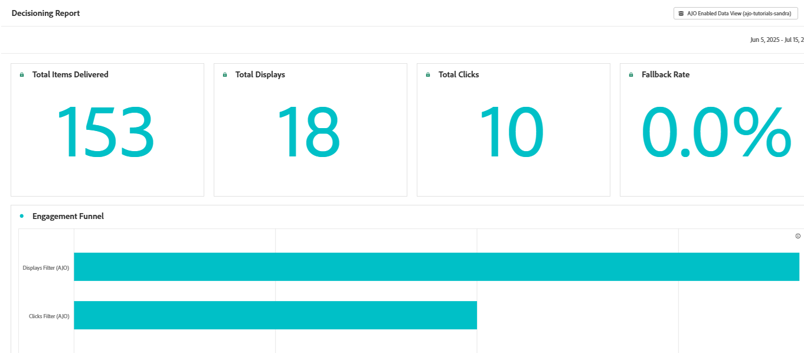

# 追蹤和報告透過Adobe Journey Optimizer Decisioning傳遞的AJO (AJO)選件

此使用案例著重於啟用透過Adobe Journey Optimizer (AJO)傳送之選件的報表和效能分析。 根據內容訊號（例如天氣或位置）個人化並提供優惠時，必須追蹤曝光次數和使用者互動，以評估其成效。

透過Adobe Web SDK擷取decisioning.propositionDisplay和decisioning.propositionInteract事件，並將它們對應至Adobe Experience Platform (AEP)中的結構化XDM方案，便可獲得優惠層級的參與資料進行分析。 這些資料然後可用於Customer Journey Analytics (CJA)來建立控制面板、測量關鍵量度(例如點進率(CTR))，以及比較不同受眾區段和情境下的選件效能。

目標是針對個人化優惠的成效提供清晰、資料導向的深入分析，並指引日後的決策策略。

## 本教學課程的先決條件

開始之前，請先完成[使用即時天氣資料個人化選件。](https://experienceleague.adobe.com/zh-hant/docs/journey-optimizer-learn/personalizing-offers-with-real-time-weather-data/introduction)它會建立所有基礎元件，包括：

- 網頁SDK整合
- Adobe Journey Optimizer (AJO)中的優惠方案設定
- 使用天氣和溫度等內容屬性來決策
- 網頁上的即時優惠方案呈現

本教學課程直接建置在該實作上，並專注於擷取選件曝光次數和互動，以便在Journey Optimizer中報告和分析。
