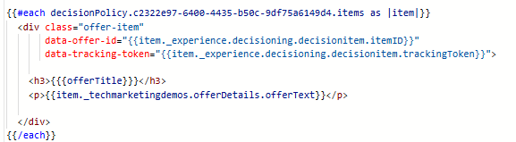

# 將追蹤權杖新增至選件專案

若要修改個人化編輯器中的程式碼，請遵循下列步驟：

導覽至&#x200B;_&#x200B;**歷程管理 — >行銷活動**&#x200B;_

開啟適當的行銷活動，然後按一下&#x200B;_&#x200B;**停止行銷活動**&#x200B;_&#x200B;按鈕以停止行銷活動。

開啟已停止的行銷活動，然後按一下&#x200B;_&#x200B;**修改行銷活動**&#x200B;_&#x200B;按鈕。

按一下「_&#x200B;**內容**&#x200B;_」標籤，然後按一下「_&#x200B;**編輯代碼**&#x200B;_」按鈕以開啟個人化編輯器。

將兩個新資料屬性新增至div，如熒幕擷圖所示

若要新增trackingToken和ItemID，請按一下左側導覽的「決定原則」圖示，然後向下展開決定樹狀結構以選取itemID和trackingToken。

這可確保每個演算後的選件都包含資料追蹤代號，這對於精確曝光和點選事件追蹤至關重要。

儲存變更並啟動行銷活動。
