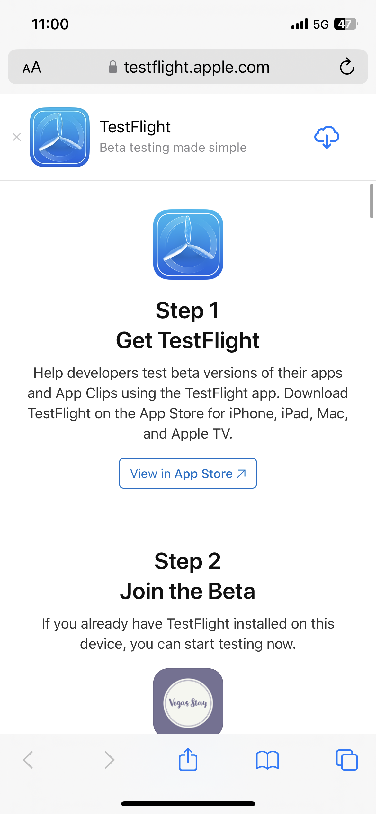
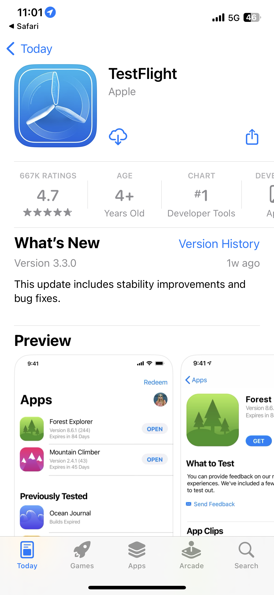
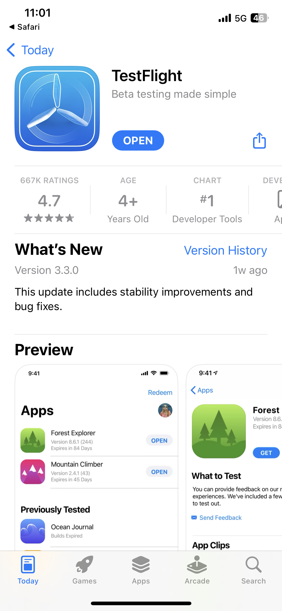
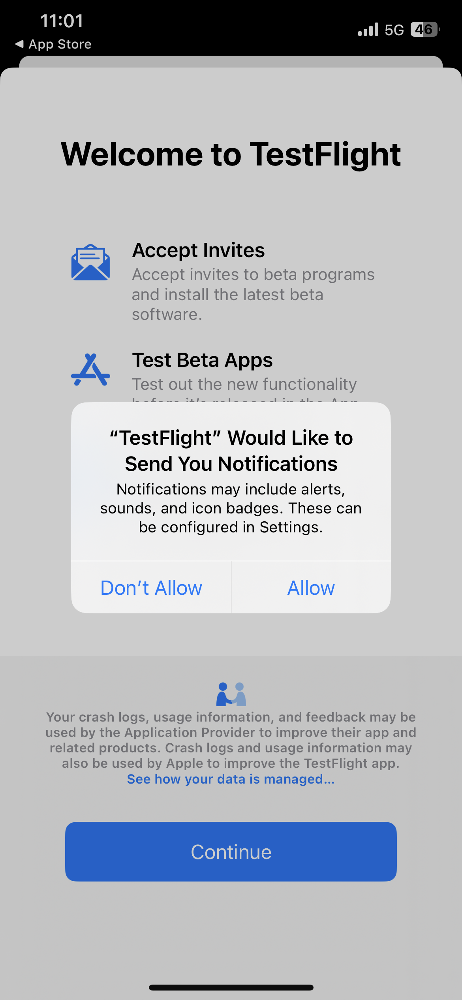
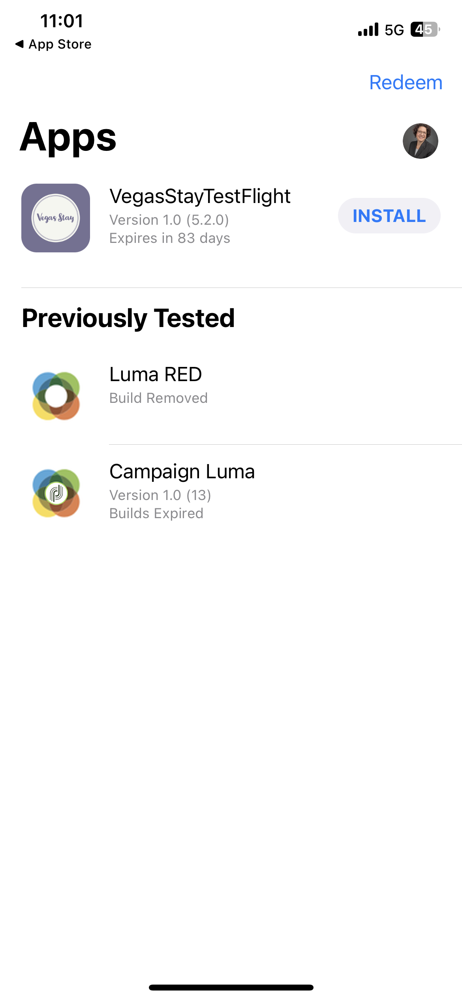
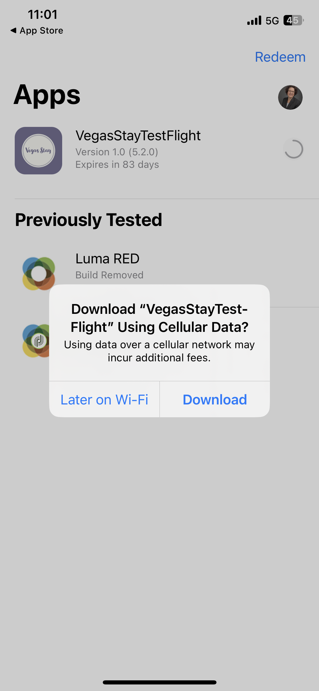
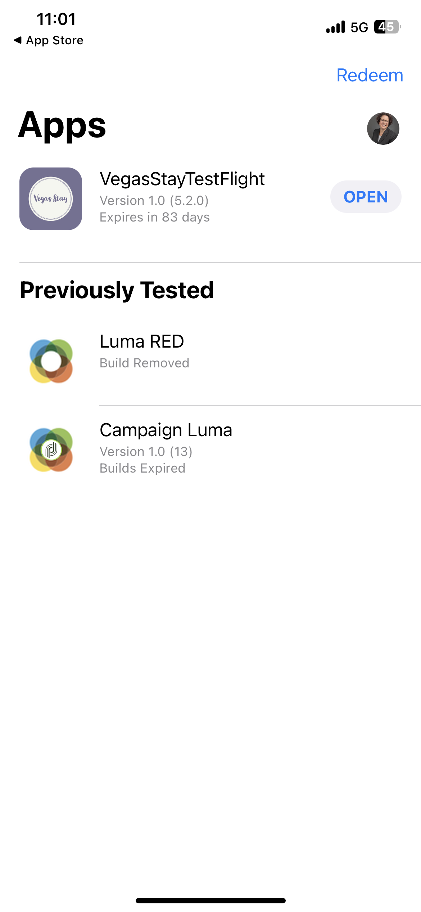
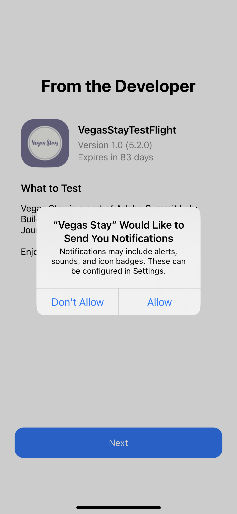

# Summit Lab L731- 速查表

本頁面包含 L731 Summit Lab 正在使用的文字及連結。 它可讓您將內容複製並貼上到 Journey Optimizer 訊息。

## 練習 1.1 - 下載並安裝應用程式

掃描 QR 碼以下載應用程式

>[!BEGINTABS]

>[!TAB iOS]

系統會要求您安裝 Testflight，步驟 1 至 4。 安裝 Testflight 後，請按照步驟 5 到 8 安裝 Vegas Stay 應用程式：

<table>
<tr>
</tr>
<tr>
<td>
 

      

      <b>步驟 1 </b>
      

      
      

  </td>
  <td>
 

      

      <b>步驟 2 </b>
      

      
      

  </td>
  <td>
 

      

      <b>步驟 3 </b>
      

      
      

  </td>
  <td>
 

      

      <b>步驟 4 </b>
      

      
      

  </td>
  </tr>
  <tr>
<td>
 

      

      <b>步驟 5 </b>
      

      
      

  </td>
  <td>
 

      

      <a>
     <b>步驟 6 </b>
      

        
      </a>
      

  </td>
  <td>
 

      

      <a>
      <b>步驟 7 </b>
      

        
      </a>
      

  </td>
  <td>
 

      

      <a>
      <b>步驟 8 </b>
      

        
      </a>
      

  </td>
  </tr>
</table>

>[!TAB Android]

由於應用程式未於 Google Play 商店註冊，因此您會收到警告訊息：

按一下&#x200B;**仍要安裝**

>[!ENDTABS]

## 練習 1：登入 Adobe Journey Optimizer

[按一下這裡以登入 Journey Optimizer](https://experience.adobe.com/#/@techmarketingdemos/sname:summit-2023-ajo-lab/journey-optimizer/home)

**登入詳細資料：**

* **使用者名稱：**`L731+<your seat number>@summitlab.us`(範例：L731+001@summitlab.us)
* **密碼：Adobe2023!**

## 練習 2 建立應用程式內行銷活動

| 欄位 | 文字 | 連結 |
|----|----|----|
| 行銷活動名稱 | `<your seat number> Vegas Stay Campaign` |  |
| 符合 | 現在預訂 |  |
| 媒體 URL 選項 |  | https://i.ibb.co/NstLhjW/Firefly-Poster-with-heading-Adobe-Max-84773.jpg |
| 標題 | 搶先購買優惠券！ |  |
| 內文 | Adobe Max回到拉斯維加斯。 準備好迎接鼓舞人心的演講者、技能擴展會議以及認識新的人。立即預定套裝，可享受10%優惠。 |  |
| 按鈕 | 享受10%的折扣！ | lab://booking?suite=presidential&amp;discount=10 |
| 按鈕：互動式事件 | 應用程式內 CTA |  |
| 基礎 URL 在裝置上預覽時使用 |  | **iOS：** lab://  **Android**： https://lab |

## 練習3：建立推播通知

| 欄位 | 文字 | 連結 |
|----|----|----|
| 行銷活動名稱 | `<your seat number> Max Push Campaign` |  |
| 媒體 URL 選項 |  | https://i.ibb.co/NstLhjW/Firefly-Poster-with-heading-Adobe-Max-84773.jpg |
| 標題 | 嗨！ |  |
| 內文 | 您知道Adobe·麥克斯要回拉斯維加斯嗎？ 立即預訂您的房間，可享受10%的折扣。 |  |
