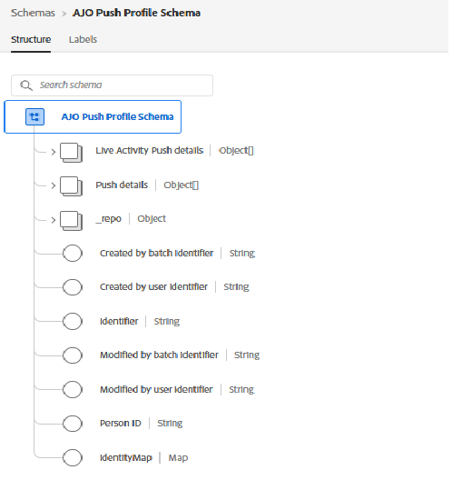

# 建立資料串流

Adobe Experience Platform (AEP)中的資料串流會作為端點，用於接收從網站SDK傳送的資料。 它會將此資料路由至已設定的服務，例如AEP、Adobe Analytics或Adobe Journey Optimizer。 在本教學課程中，資料串流可用來將網頁推送訂閱資料和price.drop事件傳送至AEP以進行啟用。

## 建立事件結構描述以追蹤推播通知

建立名稱為`SchemaForPushNotification`的新XDM ExperienceEvent結構描述。 將`Push Notification Tracking`和`Commerce Details`欄位群組新增至此結構描述。 Commerce詳細資料欄位群組中的欄位將用來擷取產品資訊及觸發自訂price.drop事件。

## 建立設定檔結構描述以儲存使用者的同意

在本教學課程中，我們使用現成可用的`AJO Push Profile Schema`。 此結構描述儲存使用者的推送訂閱詳細資料，包括傳送Web推送通知所需的推送代號。

## 為結構描述建立資料集

使用先前建立的事件結構描述建立名為`DataSetForPushNotification`的資料集。 若是設定檔資料，請使用與推播設定檔結構描述關聯的現成可用的`AJO Push Profile Dataset`。 記下`DataSetForPushNotification` ID，因為稍後在教學課程中透過.env檔案設定應用程式時，會需要記下。

## 使用事件和設定檔資料集建立資料串流

使用上一步中建立的事件和設定檔資料集，建立名為WebPushDataStream的新資料流。 記下資料串流ID，因為稍後透過.env檔案設定應用程式時，教學課程會要求記下此ID。

