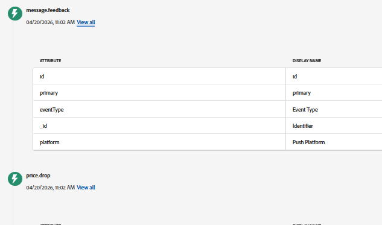

# 在AJO中偵錯Web推播

此頁面提供除錯網頁推播通知流程的實用提示，包括驗證網頁SDK請求、檢查AEP中的ECID和使用者設定檔，以及確保正確傳送和接收price.drop等事件。

- **使用Adobe Experience Platform Debugger （Chrome擴充功能）**\
  安裝適用於Chrome](https://chrome.google.com/webstore/detail/adobe-experience-platform/bfnnokhpnncpkdmbokanobigaccjkpob)的[AEP Debugger擴充功能，以更輕鬆地檢查Web SDK活動：

此工具可讓您：
 — 檢視網頁SDK請求和回應\
 — 檢查ECID (Experience Cloud ID)\
 — 驗證資料流設定和裝載

- **檢查使用者是否已識別(ECID)**\
  使用AEP Debugger或瀏覽器主控台，確認已產生ECID。 此ID可用來跨AEP和AJO追蹤使用者。

- **使用[網路]索引標籤來驗證要求**\
  開啟瀏覽器開發人員工具中的&#x200B;**網路標籤**，並篩選網頁SDK提出的要求（尋找`/collect`或`interact`）。
  - 確認請求會在頁面載入時和動作觸發時傳送
  - 檢查`price.drop`事件是否包含在承載中

- **在AEP中查詢使用者設定檔**\
  使用ECID在Adobe Experience Platform中搜尋使用者設定檔。 這有助於確認可辨識使用者，且其資料（例如推送訂閱）可正確儲存。

- **確認已收到`price.drop`事件**\
  從網頁觸發事件後，如果事件已擷取並與相同ECID建立關聯，請存取AEP。
檢查`feedback.status`的message.feedback事件的json。 狀態值應為 `sent`
  

- **確認推播通知已啟用**\
  請確定：
  - 使用者已接受瀏覽器通知提示
  - 使用者的設定檔中存在推播權杖

- **檢查歷程設定**\
  請確定歷程已發佈並設定為接聽`price.drop`事件。
