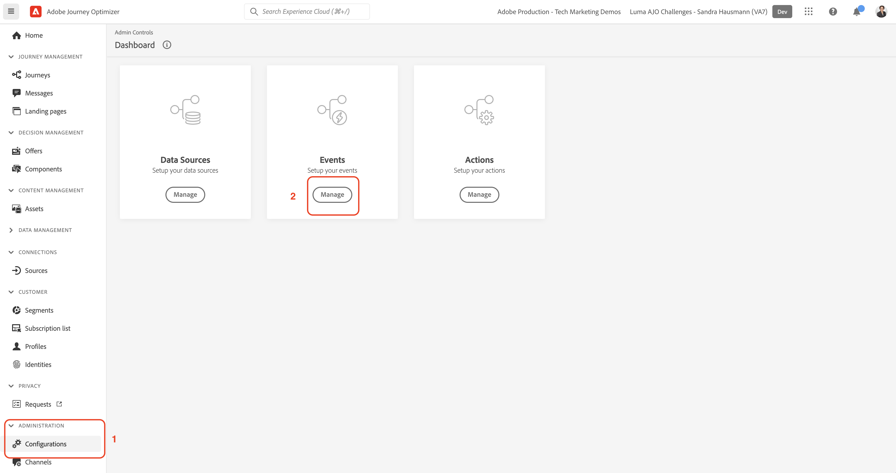

# 設定事件

在本節中，您可以在 [Journey Optimizer挑戰](/help/challenges/introduction-and-prerequisites.md).

觀看影片 [建立事件](/help/set-up-journeys/create-events.md) 以取得建立事件的指引。

## 建立Luma線上購買事件

1. 從左側導覽至 [!UICONTROL 管理] 選取 *[!UICONTROL 設定]*
1. 從 [!UICONTROL 控制面板]，選取 *[!UICONTROL 管理*]* 事件

1. 按一下 *[!UICONTROL 建立事件]*
1. 填入事件詳細資料和參數：

   | [!UICONTROL 參數] | [!UICONTROL 值] |
   |-------------|-----------|
   | [!UICONTROL 名稱] | `LumaOnlinePurchase` |
   | [!UICONTROL 類型] | [!UICONTROL 單一] |
   | [!UICONTROL 事件ID類型] | [!UICONTROL 規則型] |
   | [!UICONTROL 方案] | Luma產品互動 |
   | [!UICONTROL 欄位] | EventType  Order.priceTotal purchaseOrderNumber productListItems.quantity <b>在產品清單項目> Luma產品目錄結構> _*[!DNL yourOrganizationID]* >產品：</b>   名稱 價格 ProductImageURL ProductURL |

1. 新增 [!UICONTROL 事件ID條件]: **[!DNL LumaOnlinePurchase.eventType is commerce.purchases]**

   1. 選取鉛筆圖示以編輯欄位
   2. 在 [!UICONTROL 新增事件ID條件] 強制回應視窗，拖放 `eventType` 在畫布上
   3. 選擇 `commerce.purchases`
   4. 在畫布上選擇「確定」
   5. 在強制回應視窗上選取「確定」

1. 選擇 [!UICONTROL 命名空間]: `Luma CRM ID (lumaCrmId)`

2. 選取「**[!UICONTROL 儲存]**」。

## 建立 *[!DNL Luma Wishlist Add]* 事件

| [!UICONTROL 參數] | [!UICONTROL 值] |
|-------------|-----------|
| [!UICONTROL 名稱] | `LumaWishlistAdd` |
| [!UICONTROL 類型] | [!UICONTROL 單一] |
| [!UICONTROL 事件ID類型] | [!UICONTROL 規則型] |
| [!UICONTROL 方案] | `Luma Product Interactions` |
| [!UICONTROL 欄位] | EventType productListItem.quantity <b>在產品清單項目> Luma產品> _*[!DNL yourOrganizationID]* >產品：</b>  名稱 價格  ProductImageURL ProductURL |
| [!UICONTROL 條件] | [!DNL LumaWishlistAdd.eventType is commerce.saveForLaters] |
| [!UICONTROL 命名空間] | 電子郵件(EMail) |

## 建立*[!DNL Luma Product Restock] 事件

| [!UICONTROL 參數] | [!UICONTROL 值] |
|-------------|-----------|
| [!UICONTROL 名稱] | `LumaProductRestock` |
| [!UICONTROL 類型] | [!UICONTROL 商務] |
| [!UICONTROL 方案] | [!DNL Luma Product Inventory Events] |
| [!UICONTROL 欄位] | productID   stockEventType <b>在產品> Luma產品> *[!DNL yourOrganizationID]* >產品：</b>  名稱 價格  ProductImageURL 說明 |
| [!UICONTROL 條件] | LumaProductRestock。_`your organization's ID`.inventoryEvent.stockEventType為重新存貨 |

## 恭喜

您的沙箱現已可供使用！
