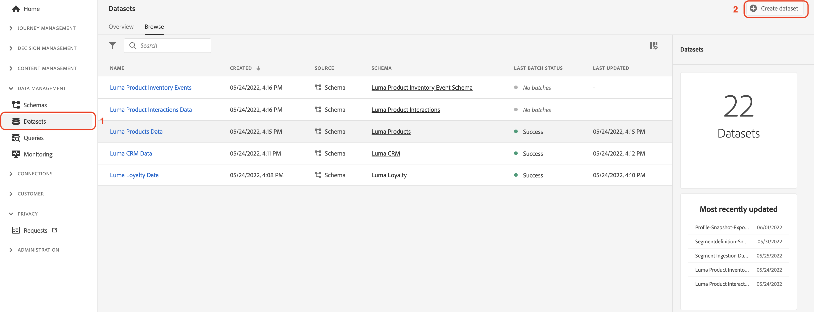
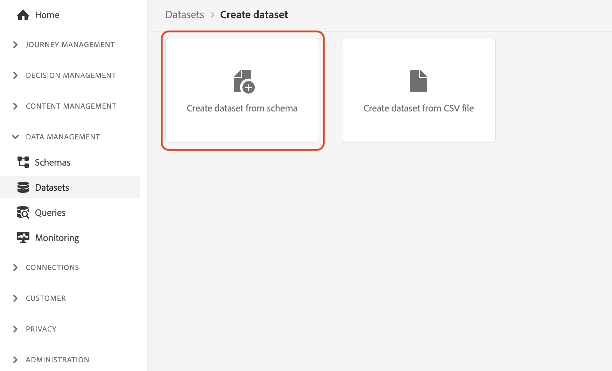
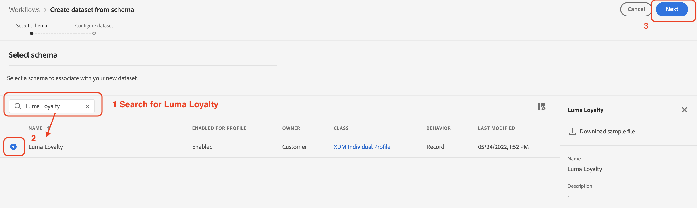
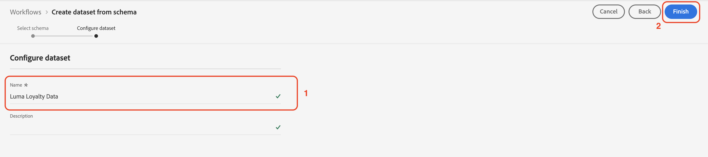
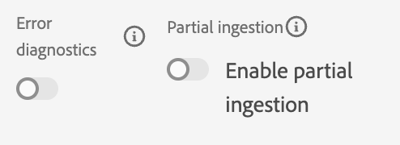

# 手動內嵌資料

本節將引導您完成建立資料集和內嵌範例資料的必要步驟。

>[!TIP]
>
> 觀看教學課程影片 [建立資料集並內嵌資料](/help/set-up-data/create-datasets-and-ingest-data.md) 開始之前。

您將建立5個 [!UICONTROL 資料集] 基於盧瑪 [!UICONTROL 綱要] 您在 [上一節](/help/tutorial-configure-a-training-sandbox/manual-data-set-up.md). 建立資料集後，即可從您下載和修改的JSON檔案內嵌資料。 (請參閱 [簡介和必要條件](/help/tutorial-configure-a-training-sandbox/introduction-and-prerequisites.md) )。

## 建立第一個資料集

建立資料集，命名為 *[!DNL Luma Loyalty Data]* 從 [!DNL Luma Loyalty schema]

1. 從左側導覽，在 [!UICONTROL 資料管理]，選取 **[!UICONTROL 資料集]**.

1. 選擇 **[!UICONTROL 建立資料集]**.

   

1. 在下一頁，選取 [!UICONTROL 從結構建立資料集].

   

1. 在下一頁，搜尋 *[!DNL Luma Loyalty]* 您先前建立的架構。

1. 選擇「*[!DNL Luma Loyalty]*」。

1. 按&#x200B;**[!UICONTROL 「下一步」]**。

   

1. 設定資料集：

   * 名稱: `Luma Loyalty Data`

1. 按一下&#x200B;**[!UICONTROL 完成]**。

   

## 內嵌範例資料

建立資料集後，您就可以將資料內嵌至資料集。

1. 在 [!DNL Luma Loyalty Data] 頁面，向下捲動至右面板底部 [!UICONTROL 新增資料] 區段和啟用：

   * **[!UICONTROL 錯誤診斷]** 和

   * **[!UICONTROL 部分擷取]**

   

1. 拖放 `luma-loyalty.json` 檔案，將範例資料上傳至資料集。

1. 重新整理頁面並檢查批次狀態，以確認檔案已正確擷取。

   375筆記錄應該被錄入。 擷取資料可能需要幾分鐘的時間。

>[!TIP]
>
>如果批次失敗，請務必取代 `luma-loyalty.json` 檔案 [組織ID](https://experienceleague.adobe.com/docs/core-services/interface/administration/organizations.html?lang=zh-Hant).

## 再建立5個 [!UICONTROL 資料集]

接下來，再建立以下五個 [!UICONTROL 資料集] 並將資料內嵌至 `Luma CRM Data`, `Luma Products Data`，和 `Luma Test Profiles` 資料集。

| 資料集名稱 | 從架構 | 要內嵌的檔案 | 記錄 |
| -----| ------ | -------| ------- |
| `Luma CRM Data` | `Luma CRM` | `luma-crm.json` | 500 |
| `Luma Products Data` | `Luma Products` | `luma-products.json` | 92 |
| `Luma Product Interactions Data` | `Luma Product Interactions` | 無 | 0 |
| `Luma Product Inventory Events` | `Luma Product Inventory Events` | 無 | 0 |
| `Luma Test Profiles` | `Luma Test Profiles` | `luma-test-profiles.json` | 3 |

## 後續步驟

您已成功建立所有必要的資料集並擷取範例資料。 最後一步是 [設定事件](/help/tutorial-configure-a-training-sandbox/configure-events.md).
