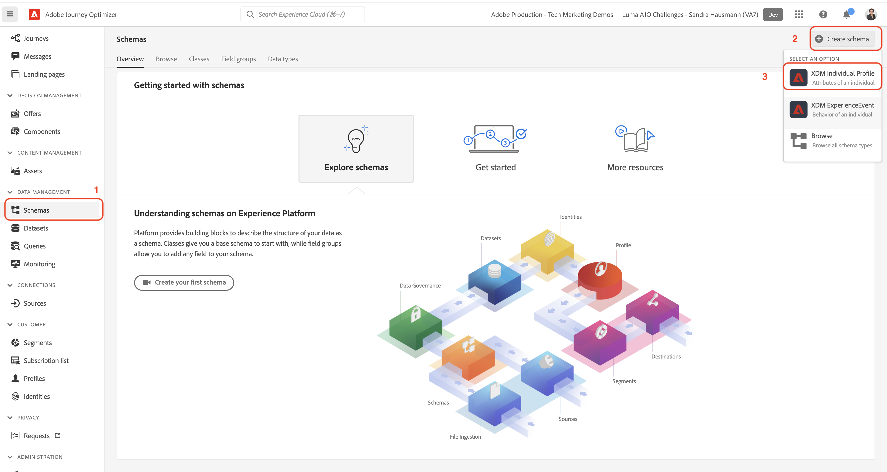

# 手動設定資料

在本節中，您會建立必要的身分識別命名空間，並定義 [!DNL Luma] 透過建立 [[!UICONTROL 綱要]](https://experienceleague.adobe.com/docs/experience-platform/xdm/schema/composition.html?lang=zh-Hant).

>[!TIP]
>觀看教學課程影片 [對應身分](/help/set-up-data/map-identities.md) 開始之前。

## 步驟1:建立身分識別命名空間

在此步驟中，您會為 [!DNL Luma] 自訂身分欄位已命名 `lumaLoyaltyId`, `lumaCrmId`，和 `lumaProductSKU`. 身分識別命名空間在建立即時客戶設定檔方面扮演關鍵角色，因為相同命名空間中的兩個相符值可讓兩個資料來源形成身分圖表。

首先，建立 [!UICONTROL 命名空間] 針對 [!DNL Luma Loyalty ID] 方案：

1. 在Journey Optimizer使用者介面中，前往***[!UICONTROL 客戶]** > **[!UICONTROL 身分]** 的下一頁。

1. 選擇 **[!UICONTROL 建立身分命名空間]**.

1. 提供下列詳細資訊：

   | 顯示名稱 | 身分符號 | 類型 |
   |---|---|---|
   | `Luma Loyalty ID` | `lumaLoyaltyId` | [!UICONTROL 跨裝置ID] |

1. 選取「**[!UICONTROL 建立]**」。

   

1. 請依照相同的步驟，再建立兩個命名空間：

   | 顯示名稱 | 身分符號 | 類型 |
   |---|---|---|
   | `Luma CRM ID` | `lumaCrmId` | [!UICONTROL 跨裝置ID] |
   | `Luma Product SKU` | `lumaProductSKU` | [!UICONTROL 非人員識別碼] |

## 步驟2:建立結構

在此步驟中，您需建立6個範例資料來定義結構 [[!UICONTROL 綱要]](https://experienceleague.adobe.com/docs/experience-platform/xdm/schema/composition.html?lang=zh-Hant):

* [[!DNL Luma Loyalty Schema]](#create-luma-loyalty-schema)

* [[!DNL Luma Product catalog Schema]](#create-luma-product-catalog-schema)

* [[!DNL Luma Product Inventory Events]](#create-luma-product-inventory-event-schema)

* [[!DNL Luma CRM Schema]](#create-luma-crm-and-luma-product-interactions-schemas)

* [[!DNL Luma Web Events Schema]](#create-luma-crm-and-luma-product-interactions-schemas)

* [[!DNL Luma Test Profiles Schema]](#create-luma-crm-and-luma-product-interactions-schemas)

>[!TIP]
>
>觀看教學課程影片： [建立結構](/help/set-up-data/create-schema.md) 開始之前。

### 建立 [!DNL Luma Loyalty] [!UICONTROL 結構] {#create-luma-loyalty-schema}

#### 建立結構

從建立 [!DNL Luma Loyalty] 方案：

1. 前往 **[!UICONTROL 資料管理]** > **[!UICONTROL 結構]** 的下一頁。

1. 選擇 **[!UICONTROL 建立結構]** 在右上角。

1. 從下拉式功能表中，選取 **[!UICONTROL XDM個別設定檔]**，因為您要建立個別客戶的屬性模型（點、狀態等）。

   

#### 新增現有欄位群組

接著，系統會提示您將欄位群組新增至架構。 您必須使用群組將所有欄位新增至結構。 您正在新增現有欄位群組，且必須建立欄位群組。

>[!NOTE]
>
>若 [!UICONTROL 欄位群組] 強制回應不會自動在 [!UICONTROL 結構] 頁面，選取 **[!UICONTROL 新增]** （如下圖所示）。

1. 在 **[!UICONTROL 新增欄位群組]** 頁，啟用下列欄位群組：

   * **[!UICONTROL 人口統計詳細資料]** 用於基本客戶資料，如名稱和出生日期。

   * **[!UICONTROL 個人聯繫人詳細資訊]** 有關基本聯繫人詳細資訊，如電子郵件地址和電話號碼。

   * **[!UICONTROL 忠誠度詳細資料]** 用於忠誠度詳細資訊，如點數、加入日期或狀態。 忠誠度欄位群組在清單中排名很靠前，因此最容易搜尋。

1. 選擇 **[!UICONTROL 新增欄位群組]** 將所有三個欄位群組新增至架構。

   

1. 選取架構的頂端節點。

1. 輸入 `Luma Loyalty Schema` 作為 [!UICONTROL 顯示名稱].

#### 建立 [!UICONTROL 欄位群組]

為幫助確保架構之間的一致性，Adobe建議管理單個組中的所有系統標識符：

1. 從 **[!UICONTROL 組合物]** 一節 [!UICONTROL 欄位群組]，選取 **[!UICONTROL 新增]**.

1. 選擇 **[!UICONTROL 建立新欄位組]**.

1. 新增 `Luma Identity Profile Field Group` 作為 **[!UICONTROL 顯示名稱]**.

1. 新增 `system identifiers for XDM Individual Profile class` 作為 **[!UICONTROL 說明]**.

1. 選擇 **[!UICONTROL 新增欄位群組]**.

   

#### 新增欄位至新 [!UICONTROL 欄位群組]

新的空白欄位群組會新增至您的架構。 使用+按鈕，您可以將新欄位新增至階層中的任何位置。 在此情況下，您必須新增根層級的欄位：

1. 選擇 **[!UICONTROL +]** 方案名稱旁邊。

   此步驟會在 **您的租用戶id** 命名空間，以管理自訂欄位和任何標準欄位之間的衝突。

1. 在 **[!UICONTROL 欄位屬性]** 邊欄，添加新欄位的詳細資訊：

   * **欄位名稱:** `systemIdentifier`

   * **[!UICONTROL 顯示名稱]：**`System Identifier`

   * **類型：** 物件

   * **[!UICONTROL 分配欄位組]:** [!DNL Luma identifiers]

1. 選擇 **[!UICONTROL 套用]**.

   

   在 `systemIdentifier` 物件：

   | [!UICONTROL 欄位名稱] | [!UICONTROL 顯示名稱] | [!UICONTROL 類型] |
   |-------------|-----------|----------|
   | `loyaltyId` | `Loyalty ID` | [!UICONTROL 字串] |
   | `crmId` | `CRM Id` | [!UICONTROL 字串] |

#### 設定身分

您現在擁有 [!UICONTROL 命名空間] 和 [!DNL Luma Loyalty schema] 已設定。 您必須先標籤身分欄位，才能內嵌資料。 與 [!UICONTROL 即時客戶個人檔案] 需要，才能指定主要身分，且每個擷取的記錄必須具有該欄位的值。

1. 設定 **主要身分**:

   從 **[!DNL Luma Loyalty Schema]**:

   1. 選取 **[!DNL Luma Identity Profile Field Group]**。

   2. 選取 **[!DNL loyaltyId]** 欄位。

   3. 在 **[!UICONTROL 欄位屬性]**，啟用 **[!UICONTROL 身分]** 框。

   4. 啟用 **[!UICONTROL 主要身分]** 框。

   5. 選取 `Luma Loyalty Id` 命名空間 **[!UICONTROL 身分識別命名空間]** 下拉式清單。

   6. 選擇 **[!UICONTROL 套用]**.

      

2. 設定 **次要身分**:

   從 **[!DNL Luma Loyalty Schema]**:

   1. 選取 **[!DNL Luma Identity Profile Field Group]**...

   2. 選取 `crmId` 欄位。

   3. 在 **[!UICONTROL 欄位屬性]**，啟用 **[!UICONTROL 身分]** 框。

   4. 選取 `Luma CRM Id` 命名空間 **[!UICONTROL 身分識別命名空間]** 下拉式清單。

   5. 選擇 **[!UICONTROL 套用]**.

#### 啟用設定檔並儲存結構

1. 選取架構的頂端節點。

1. 在 [!UICONTROL 欄位屬性] 啟用 **[!UICONTROL 設定檔]**.

   架構應如下所示：

   

1. 選取「**[!UICONTROL 儲存]**」。

### 建立 [!DNL Luma Product catalog Schema] {#create-luma-product-catalog-schema}

1. 前往 [!UICONTROL 資料管理] -> **[!UICONTROL 結構]** 的下一頁。

1. 選取 **[!UICONTROL 建立結構]** 按鈕。

1. 從下拉式功能表中，選取 **[!UICONTROL 瀏覽所有架構類型]**，可讓您建立類別。

1. 選擇**[!UICONTROL 建立新類].

1. 添加顯示名稱： `Luma Product Catalog Class`.

1. 分配類。

1. 建立 [!UICONTROL 欄位群組]:

   * 顯示名稱： `Luma Product Catalog Field Group`

1. 將下列欄位新增至 **[!DNL Luma Product Catalog Field Group]**.

   * 欄位名稱: `product`

   * 顯示名稱： `Product`

   * 類型： [!UICONTROL 物件]

   * 欄位群組: [!DNL Luma Product Catalog Field Group]

1. 選擇 **[!UICONTROL 套用]**.

1. 將下列欄位新增至 **[!DNL Product]** 物件：

   | [!UICONTROL 欄位名稱] | [!UICONTROL 顯示名稱] | [!UICONTROL 類型] |
   |-------------|-----------|----------|
   | `sku` | `SKU` | [!UICONTROL 字串] |
   | `name` | `Name` | [!UICONTROL 字串] |
   | `category` | `Category` | [!UICONTROL 字串] |
   | `color` | `Color` | [!UICONTROL 字串] |
   | `size` | `Size` | [!UICONTROL 字串] |
   | `price` | `Price` | [!UICONTROL 雙倍] |
   | `description` | `Description` | [!UICONTROL 字串] |
   | `ImageURL` | `Image URL` | [!UICONTROL 字串] |
   | `stockQuantity` | `Stock Quantity` | [!UICONTROL 字串] |

1. 設定 **[!DNL SKU]** 作為主要身分
1. 新增 **[!UICONTROL 顯示名稱]** `Luma Product Catalog Field Group` 到 [!UICONTROL 欄位群組].

1. 選取「**[!UICONTROL 儲存]**」。

### 建立 [!DNL Luma Product Inventory Event Schema] {#create-luma-product-inventory-event-schema}

1. 前往 **[!UICONTROL 資料管理]** -> **[!UICONTROL 結構]** 的下一頁。

1. 選取 **[!UICONTROL 建立結構]** 按鈕。

1. 從下拉式功能表中，選取 **[!UICONTROL 瀏覽所有架構類型]**.

1. 選擇 **[!UICONTROL 建立新類]**.

1. 添加顯示名稱： `Luma Business Event Class`.

1. 選擇類型： *[!UICONTROL 時間序列]*.

1. 分配類。

1. 建立 [!UICONTROL 欄位群組]:

   * 顯示名稱： `Luma Product Inventory Event Details Field Group`

1. 新增 **[!UICONTROL 顯示名稱]** `Luma Product Inventory Event Schema` 至結構。

1. 將下列欄位新增至 **[!DNL Luma Product Inventory Event Details Field Group]**:

   * 欄位名稱: `inventoryEvent`

   * 顯示名稱： `Inventory Event`

   * 類型： [!UICONTROL 物件]

   * 欄位群組: `Luma Product Inventory Event Details Field Group`

1. 將下列欄位新增至 `Product Inventory Event Details` 物件：

   | [!UICONTROL 欄位名稱] | [!UICONTROL 顯示名稱] | [!UICONTROL 類型] |
   |-------------|-----------|----------|
   | `sku` | `SKU` | [!UICONTROL 字串] |
   | `stockEventType` | `Stock Event Type` | [!UICONTROL 字串] |

   1. 設定 `stockEventType` 要枚舉，請選擇類型： `string`.

   2. 向下捲動至 **[!UICONTROL 欄位屬性]**.

   3. 啟用 **[!UICONTROL 列舉]**.

   4. 輸入 **[!UICONTROL 值] ([!UICONTROL 標籤)]**: `restock` (`restock`)。

   5. 選擇 **[!UICONTROL 新增列]**.

   6. 輸入 **[!UICONTROL 值] ([!UICONTROL 標籤)]**: `outOfStock` (`out of stock`)。

   7. 選擇 **[!UICONTROL 套用]**.

      

1. 設定 `productId` 欄位 **[!UICONTROL 主要身分]** 使用 **[!DNL Luma Product namespace]**.

1. 選取 `sku` 欄位並定義與 `product.sku` 欄位 **[!DNL Luma Product catalog Schema]** 結構：

   1. 向下捲動至 **[!UICONTROL 欄位屬性]**.

   2. 啟用 **[!UICONTROL 關係]**.

      1. **[!UICONTROL 參考結構]**: [!DNL Luma Product catalog Schema].

      2. **[!UICONTROL 參考身分命名空間]**: [!DNL Luma Product].
   3. 選擇 **[!UICONTROL 套用]**.

      架構應如下所示：

      

1. 啟用 **設定檔**.

1. 選擇 [!UICONTROL 儲存] 以儲存結構。

### 建立 [!DNL Luma CRM] 和 [!DNL Luma Product Interactions] 綱要 {#create-luma-crm-and-luma-product-interactions-schemas}

建立下列其他 [!UICONTROL 綱要]:

| [!UICONTROL 顯示名稱] | [!DNL Luma CRM] | [!DNL Luma Product Interactions] | [!DNL Luma Test Profiles] |
|  ---| ------- | ---- |----|
| **[!UICONTROL 類型]** | [!UICONTROL XDM個別設定檔] | [!UICONTROL XDM體驗事件] | [!UICONTROL XDM個別設定檔] |
| **[!UICONTROL 添加現有欄位組]** | Luma識別碼 人口統計詳細資料 個人聯繫人詳細資訊 | 身分對應 商務詳細資訊 | Luma識別碼 人口統計詳細資料 個人聯繫人詳細資訊 設定檔測試詳細資訊 |
| **[!UICONTROL 關係]** |  | *[!DNL productListItems.SKU]*:  參考結構 *[!DNL Luma Product catalog Schema]*  [!DNL Reference identity namespace] *[!DNL Luma Product]* 綱要 |
| **[!UICONTROL 主要身分] [!UICONTROL 命名空間])** | systemIdentifier.crmId (Luma CRM Id) |  | personalEmail.address (Email) |
| **[!UICONTROL 次要身分] [!UICONTROL 命名空間]** | personalEmail.address（電子郵件） mobilePhone.number(Phone) |  |
| **[!UICONTROL 啟用設定檔]** | 是 | 是 | 是 |

## 後續步驟

現在您已建立資料結構，您 [建立資料集和內嵌範例資料](/help/tutorial-configure-a-training-sandbox/manual-data-ingestion.md).
