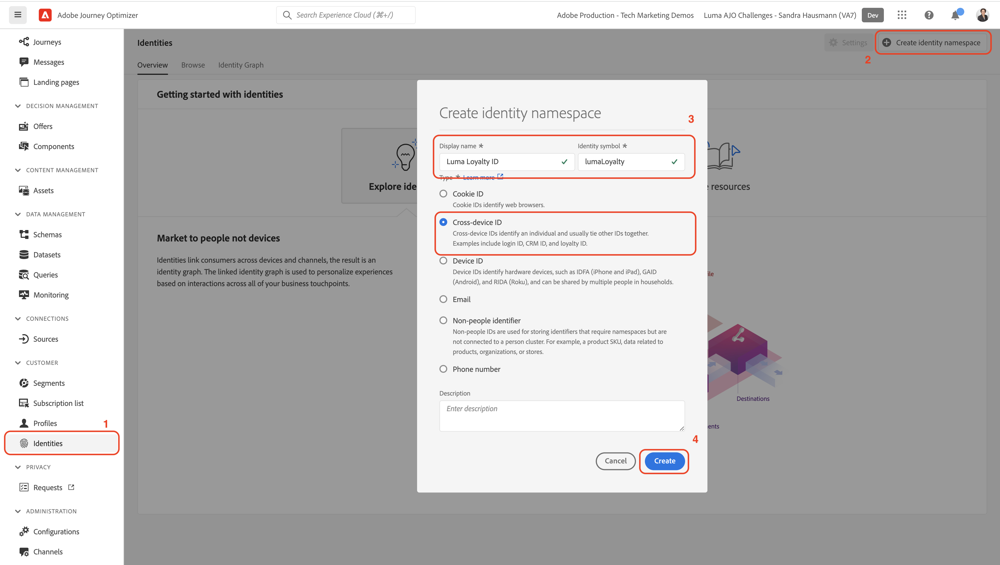
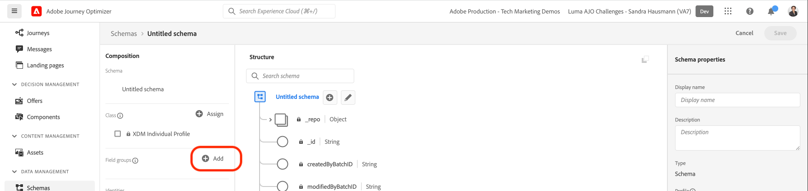
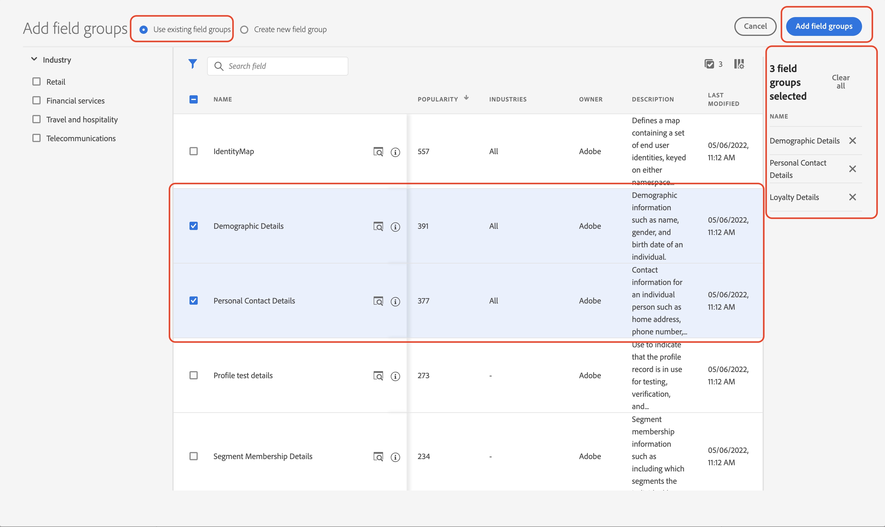
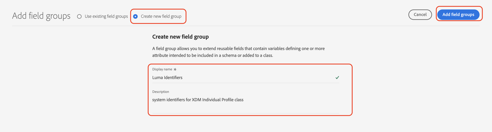
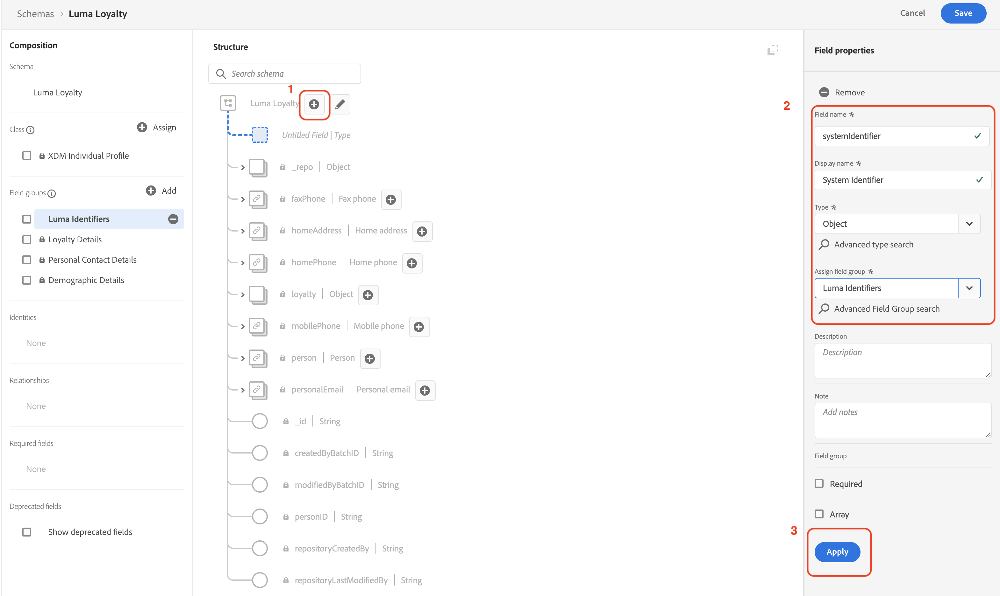
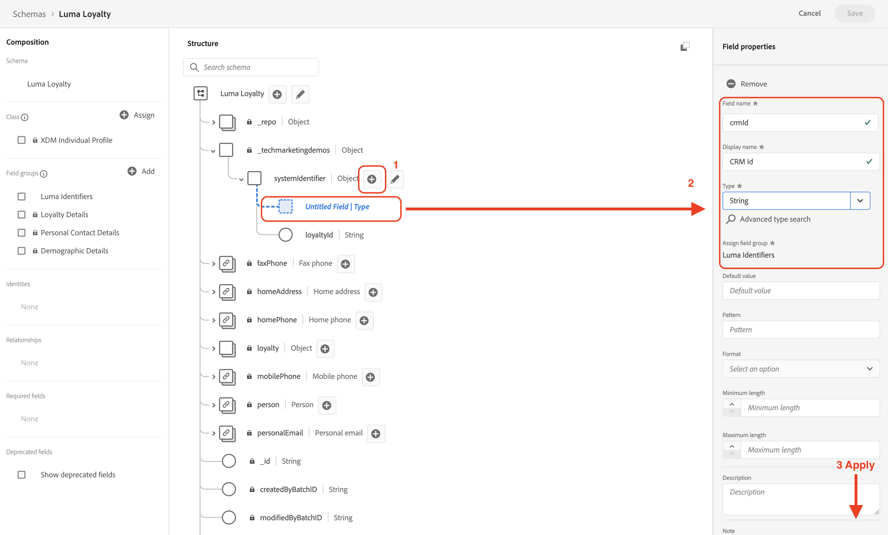
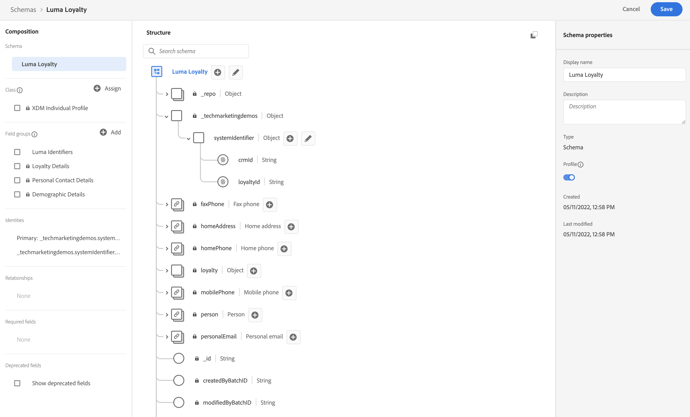
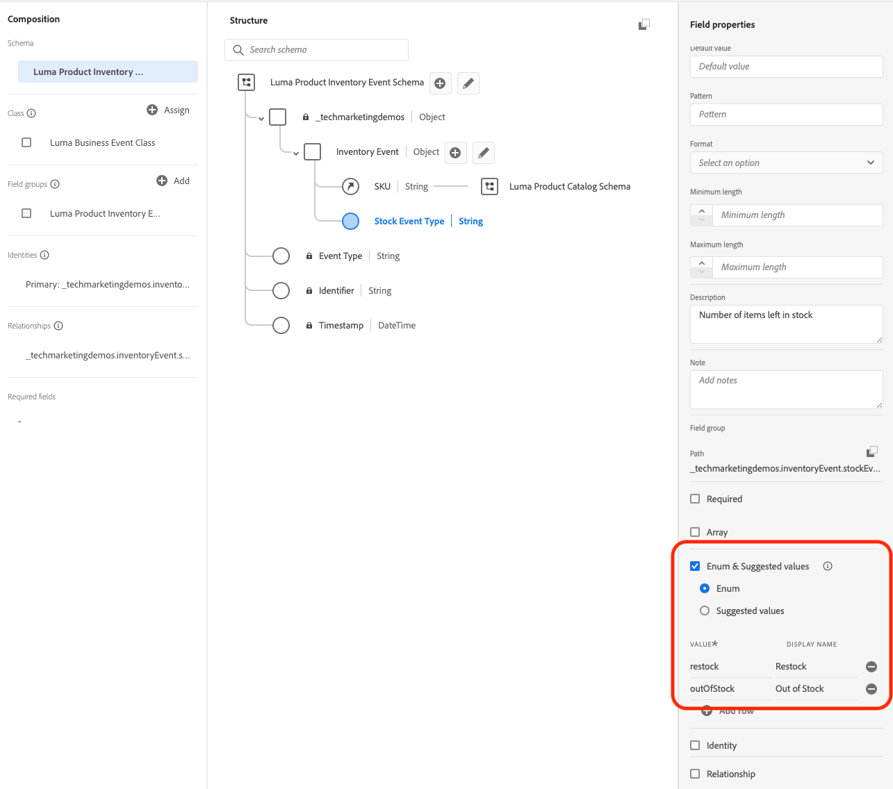
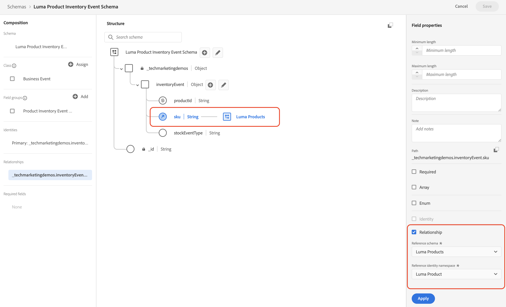

# 手動設定資料

在本節中，您將建立必要的身分識別命名空間，並透過建立[[!UICONTROL 結構]來定義[!DNL Luma]範例資料結構](https://experienceleague.adobe.com/docs/experience-platform/xdm/schema/composition.html?lang=zh-Hant)。

>[!TIP]
>在開始之前，請觀看教學課程影片[對應身分](/help/set-up-data/map-identities.md)。

## 步驟 1：建立身分識別命名空間

在此步驟中，您將為名為`lumaLoyaltyId`、`lumaCrmId`及`lumaProductSKU`的[!DNL Luma]自訂身分識別欄位建立身分識別命名空間。身分識別命名空間在建立即時客戶設定檔方面扮演關鍵角色，因為相同命名空間中的兩個相符值可讓兩個資料來源形成身分識別圖表。

首先，為[!DNL Luma Loyalty ID]方案建立[!UICONTROL 命名空間]：

1. 在 Journey Optimizer 使用者介面，前往左側導覽的&#x200B;**[!UICONTROL 客戶]** > **[!UICONTROL 身分識別]**。

1. 選取&#x200B;**[!UICONTROL 建立身分識別命名空間]**。

1. 提供以下資訊：

   | 顯示名稱 | 身分識別符號 | 類型 |
   |---|---|---|
   | `Luma Loyalty ID` | `lumaLoyaltyId` | [!UICONTROL 跨裝置 ID] |

1. 選取「**[!UICONTROL 建立]**」。

   

1. 請依照相同的步驟，再建立兩個命名空間：

   | 顯示名稱 | 身分識別符號 | 類型 |
   |---|---|---|
   | `Luma CRM ID` | `lumaCrmId` | [!UICONTROL 跨裝置 ID] |
   | `Luma Product SKU` | `lumaProductSKU` | [!UICONTROL 非人員識別碼] |

## 步驟 2：建立結構

在此步驟中，您需建立六個[[!UICONTROL 結構]](https://experienceleague.adobe.com/docs/experience-platform/xdm/schema/composition.html?lang=zh-Hant)來定義範例資料的結構：

* [[!DNL Luma Loyalty Schema]](#create-luma-loyalty-schema)

* [[!DNL Luma Product Catalog Schema]](#create-luma-product-catalog-schema)

* [[!DNL Luma Product Inventory Events] 方案](#create-luma-product-inventory-event-schema)

* [[!DNL Luma CRM Schema]](#create-luma-crm-and-luma-product-interactions-schemas)

* [[!DNL Luma Web Events Schema]](#create-luma-crm-and-luma-product-interactions-schemas)

* [[!DNL Luma Offline Purchase Events Schema]](#create-additional-schemas)

* [[!DNL Luma Test Profiles Schema]](#create-additional-schemas)

>[!TIP]
>
>在開始之前，請觀看教學課程影片：[建立結構](/help/set-up-data/create-schema.md) 。

### 建立 [!DNL Luma Loyalty Schema] {#create-luma-loyalty-schema}

本節說明如何建立[!DNL Luma Loyalty]結構及設定欄位群組。

#### 建立結構

1. 前往左側導覽的&#x200B;**[!UICONTROL 資料管理]** > **[!UICONTROL 結構]**。

1. 選取右上角的&#x200B;**[!UICONTROL 建立結構]**。

1. 從下拉式功能表中，選取 **[!UICONTROL XDM 個別設定檔]**。

   選擇此選項是因為您要對個別客戶的屬性 (點數、狀態等) 建立模式。

#### 新增現有欄位群組

接著，系統會提示您使用群組將欄位群組新增至架構。您必須新增現有欄位群組並建立欄位群組。

1. 在[!UICONTROL 結構]頁面，如果欄位群組強制回應未自動開啟，請選取&#x200B;**[!UICONTROL 新增]**。

   

1. 在&#x200B;**[!UICONTROL 新增欄位群組]**&#x200B;頁，啟用下列欄位群組：

   * **[!UICONTROL 人口統計詳細資料]**&#x200B;用於基本客戶資料，如名稱和出生日期。

   * **[!UICONTROL 個人聯絡詳細資訊]**&#x200B;有關基本聯絡詳細資訊，如電子郵件地址和電話號碼。

   * **[!UICONTROL 忠誠度詳細資料]**，用於忠誠度詳細資訊，如點數、加入日期或狀態。 忠誠度欄位群組在清單的最下方，因此最容易搜尋。

1. 選取&#x200B;**[!UICONTROL 新增欄位群組]**&#x200B;將所有三個欄位群組新增至架構。

   

1. 選取架構的頂端節點。

1. 請輸入`Luma Loyalty Schema`作為&#x200B;**[!UICONTROL 顯示名稱]**。

#### 建立[!UICONTROL 欄位群組] {#create-field-group}

為幫助確保架構之間的一致性，Adobe 建議管理單個群組中的所有系統識別碼：

1. 從[!UICONTROL 欄位群組]下的&#x200B;**[!UICONTROL 組合]**&#x200B;部分，選擇&#x200B;**[!UICONTROL 新增]**。

1. 選取&#x200B;**[!UICONTROL 建立新欄位群組]**。

1. 新增`Luma Identity Profile Field Group`作為&#x200B;**[!UICONTROL 顯示名稱]**。

1. 新增`system identifiers for XDM Individual Profile class`作為&#x200B;**[!UICONTROL 說明]**。

1. 選取&#x200B;**[!UICONTROL 「新增欄位群組」]**。

   

#### 將欄位新增至新的[!UICONTROL 欄位群組]

新的空白欄位群組會新增至您的架構。 使用 + 按鈕，您可以將新欄位新增至階層中的任何位置。 在此情況下，您必須新增根層級的欄位：

1. 選取架構名稱旁邊的 **[!UICONTROL +]**。

   此步驟在&#x200B;**租用戶 ID** 命名空間下新增一個欄位，以管理自訂欄位與任何標準欄位之間的衝突。

1. 在&#x200B;**[!UICONTROL 欄位屬性]**&#x200B;資訊看板，新增新欄位的詳細資訊：

   * **欄位名稱:** `systemIdentifier`

   * **[!UICONTROL 顯示名稱]：**`System Identifier`

   * **類型：**&#x200B;物件

   * **[!UICONTROL 指派欄位群組]：** [!DNL Luma identifiers]

1. 選取&#x200B;**[!UICONTROL 「套用」]**。

   

   在`systemIdentifier`物件下新增兩個欄位：

   | [!UICONTROL 欄位名稱] | [!UICONTROL 顯示名稱] | [!UICONTROL 類型] |
   |-------------|-----------|----------|
   | `loyaltyId` | `Loyalty Id` | [!UICONTROL 字串] |
   | `crmId` | `CRM Id` | [!UICONTROL 字串] |

#### 設定身分識別

您現在擁有[!UICONTROL 命名空間]及[!DNL Luma Loyalty schema]設定。您必須先標籤身分識別欄位，才能內嵌資料。 與[!UICONTROL 即時客戶設定檔]一起使用的每個架構都需要指定主要身分，並且每個內嵌的記錄都必須具有該欄位的值。

1. 設定&#x200B;**主要身分識別**：

   從&#x200B;**[!DNL Luma Loyalty Schema]**：

   1. 選取 **[!DNL Luma Identity Profile Field Group]**。

   2. 選取&#x200B;**[!DNL loyaltyId]**&#x200B;欄位。

   3. 在&#x200B;**[!UICONTROL 欄位屬性]**，啟用&#x200B;**[!UICONTROL 身分識別]**&#x200B;方塊。

   4. 啟用&#x200B;**[!UICONTROL 主要身分識別]**&#x200B;方塊。

   5. 從&#x200B;**[!UICONTROL 身分識別命名空間]**&#x200B;下拉式功能表中選取`Luma Loyalty Id`命名空間。

   6. 選取&#x200B;**[!UICONTROL 「套用」]**。

      

2. 設定&#x200B;**次要身分識別**：

   從&#x200B;**[!DNL Luma Loyalty Schema]**：

   1. 選取 **[!DNL Luma Identity Profile Field Group]**。

   2. 選取`crmId`欄位。

   3. 在&#x200B;**[!UICONTROL 欄位屬性]**&#x200B;中，啟用&#x200B;**[!UICONTROL 身分識別]**&#x200B;方塊。

   4. 從&#x200B;**[!UICONTROL 身分識別命名空間]**&#x200B;下拉式清單中選擇`Luma CRM Id`命名空間。

   5. 選取&#x200B;**[!UICONTROL 「套用」]**。

#### 啟用設定檔並儲存結構

1. 選取架構的頂端節點。

1. 在[!UICONTROL 欄位屬性]中，啟用&#x200B;**[!UICONTROL 設定檔]**。

   架構應如下所示：

   

1. 選取「**[!UICONTROL 儲存]**」。

### 建立 [!DNL Luma Product Catalog Schema] {#create-luma-product-catalog-schema}

1. 前往左側導覽中的&#x200B;**[!UICONTROL 資料管理]** > **[!UICONTROL 結構]**。

1. 選取&#x200B;**[!UICONTROL 建立結構]** (右上方)。

1. 若要建立類別，請從下拉式功能表選取&#x200B;**[!UICONTROL 瀏覽所有架構類型]**。

1. 選取&#x200B;**[!UICONTROL 建立新類別]**。

1. 新增顯示名稱：`Luma Product Catalog Class`。

1. 指派類別。

1. 建立[!UICONTROL 欄位群組]：

   * 顯示名稱：`Luma Product Catalog Field Group`

1. 將下列欄位新增至&#x200B;**[!DNL Luma Product Catalog Field Group]**。

   * 欄位名稱: `product`

   * 顯示名稱：`Product`

   * 類型：[!UICONTROL 物件]

   * 欄位群組: [!DNL Luma Product Catalog Field Group]

1. 選取&#x200B;**[!UICONTROL 「套用」]**。

1. 將下列欄位新增至&#x200B;**[!DNL Product]**&#x200B;物件：

   | [!UICONTROL 欄位名稱] | [!UICONTROL 顯示名稱] | [!UICONTROL 類型] |
   |-------------|-----------|----------|
   | `sku` | `Product SKU` | [!UICONTROL 字串] |
   | `name` | `Product Name` | [!UICONTROL 字串] |
   | `category` | `Product Category` | [!UICONTROL 字串] |
   | `color` | `Product Color` | [!UICONTROL 字串] |
   | `size` | `Product Size` | [!UICONTROL 字串] |
   | `price` | `Product Price` | [!UICONTROL 雙倍] |
   | `description` | `Product Description` | [!UICONTROL 字串] |
   | `imageURL` | `Product Image URL` | [!UICONTROL 字串] |
   | `stockQuantity` | `Product Stock Quantity` | [!UICONTROL 字串] |
   | `url` | `Product URL` | [!UICONTROL 字串] |

1. 將&#x200B;**[!DNL SKU]**&#x200B;設定為主要身分識別。
1. 將&#x200B;**[!UICONTROL 顯示名稱]**`Luma Product Catalog Field Group`新增至[!UICONTROL 欄位群組]。

1. 選取「**[!UICONTROL 儲存]**」。

### 建立 [!DNL Luma Product Inventory Event Schema] {#create-luma-product-inventory-event-schema}

1. 前往左側導覽中的&#x200B;**[!UICONTROL 資料管理]** > **[!UICONTROL 結構]**。

1. 選取右上角的&#x200B;**[!UICONTROL 建立結構]**&#x200B;按鈕。

1. 從下拉式功能表選取&#x200B;**[!UICONTROL 瀏覽所有架構類型]**。

1. 選取&#x200B;**[!UICONTROL 建立新類別]**。

1. 新增顯示名稱：`Luma Business Event Class`。

1. 選擇類型：*[!UICONTROL 時間序列]*。

1. 指派類別。

1. 建立[!UICONTROL 欄位群組]：

   * 顯示名稱：`Luma Product Inventory Event Details Field Group`

1. 將&#x200B;**[!UICONTROL 顯示名稱]** `Luma Product Inventory Event Schema`新增至結構。

1. 將下列欄位新增至&#x200B;**[!DNL Luma Product Inventory Event Details Field Group]**：

   * 欄位名稱: `inventoryEvent`

   * 顯示名稱：`Inventory Event`

   * 類型：[!UICONTROL 物件]

   * 欄位群組: `Luma Product Inventory Event Details Field Group`

1. 將下列欄位新增至`Product Inventory Event Details`物件：

   | [!UICONTROL 欄位名稱] | [!UICONTROL 顯示名稱] | [!UICONTROL 類型] |
   |-------------|-----------|----------|
   | `sku` | `SKU` | [!UICONTROL 字串] |
   | `stockEventType` | `Stock Event Type` | [!UICONTROL 字串] |

   1. 要將`stockEventType`設定為列舉，請選擇類型：`string`。

   2. 向下捲動至&#x200B;**[!UICONTROL 欄位屬性]**&#x200B;底部。

   3. 啟用&#x200B;**[!UICONTROL 列舉]**。

   4. 請輸入&#x200B;**[!UICONTROL 值] ([!UICONTROL 標籤)]**：`restock` (`Restock`)。

   5. 選取&#x200B;**[!UICONTROL 新增資料列]**。

   6. 請輸入&#x200B;**[!UICONTROL 值] ([!UICONTROL 標籤)]**：`outOfStock` (`Out of Stock`)。

   7. 選取&#x200B;**[!UICONTROL 「套用」]**。

      

1. 使用&#x200B;**[!DNL LumaProductSKU namespace]**&#x200B;將`inventory.Event.sku`欄位設定為&#x200B;**[!UICONTROL 主要身分識別]**。

1. 選擇`sku`欄位並定義與&#x200B;**[!DNL Luma Product catalog Schema]**&#x200B;架構中的`product.sku`欄位的關係：

   1. 向下捲動至&#x200B;**[!UICONTROL 欄位屬性]**&#x200B;的底部。

   2. 啟用&#x200B;**[!UICONTROL 關係]**。

      1. **[!UICONTROL 參考結構]**：[!DNL Luma Product Catalog Schema]。

      2. **[!UICONTROL 參考身分識別命名空間]**：[!DNL LumaProductSKU]。
   3. 選取&#x200B;**[!UICONTROL 「套用」]**。

      架構應如下所示：

      

1. 啟用&#x200B;**設定檔**。

1. 選取[!UICONTROL 儲存]，即可儲存您的結構。

### 建立其他結構 {#create-additional-schemas}

建立下列其他[!UICONTROL 結構]：

| [!UICONTROL 顯示名稱] | [!DNL Luma CRM Schema] | [!DNL Luma Web Events Schema] | [!DNL Luma Test Profiles schema] | [!DNL Luma Offline Purchase Events Schema] |
|  ---| ------- | ---- |----|----|
| **[!UICONTROL 類別]** | [!UICONTROL XDM 個別設定檔] | [!UICONTROL XDM 體驗事件] | [!UICONTROL XDM 個別設定檔] | [IUICONTROL XDM ExperienceEvent] |
| **[!UICONTROL 新增現有欄位群組]** | `Luma Identity Profile Field Group` `Demographic Details` `Personal Contact Details` | `Orchestration eventID` `Consumer Experience Event` `AEP Web SDK ExperienceEvent` | `Luma Identity Profile Field Group` `Demographic Details` `Personal Contact Details` `Profile test details` | `Luma Identity Profile Field Group`  `Commerce Details` |
| **[!UICONTROL 關係]** |  | `productListItems.SKU`： 參考結構`Luma Product Catalog Schema`  [!DNL Reference identity namespace] `lumaProductSKU` |  | `productListItems.SKU`： 參考結構`Luma Product Catalog Schema`  [!DNL Reference identity namespace] `lumaProductSKU` |
| **[!UICONTROL 主要身分識別] [!UICONTROL 命名空間])** | `systemIdentifier.crmId` |  | `systemIdentifier.crmId` | `systemIdentifier.LoyaltyId` |
| **[!UICONTROL 啟用設定檔]** | 是 | 是 | 是 | 是 |

## 後續步驟

現在您已建立資料結構，您[建立資料集和內嵌範例資料](/help/tutorial-configure-a-training-sandbox/manual-data-ingestion.md)。
