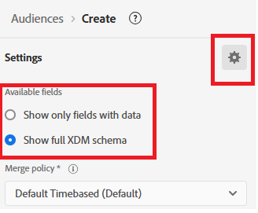

# 在Adobe Journey Optimizer中建立對象

Adobe Experience Platform中的受眾是根據動作、偏好設定或設定檔資訊建立的使用者群組，用以提供個人化體驗。

* 登入Journey Optimizer
* 導覽至「客戶 — >對象 — >建立對象」
* 使用建置規則方法建立對象

  

* 建立下列3個對象

   * 對股票感興趣的客戶

   * 對債券感興趣的客戶

   * 對CD感興趣的客戶

* 確定每個對象的評估方法已設定為&#x200B;_**Edge**_，以便即時取得資格。
  

* 使用PreferredFinancialInstrument欄位，根據使用者選取的投資興趣（例如股票、債券或光碟）來劃分使用者

>[!NOTE]
>
>>如果PreferredFinancialInstrument欄位未顯示在events標籤中，請按一下設定圖示並切換Show the full XDM schema。

