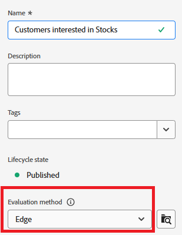

# 在AEP中設定XDM結構描述、資料集、資料流和受眾

* 登入Adobe Experience Platform

* 在Journey Optimizer中建立稱為「財務顧問」的XDM事件型結構描述。 如果您不熟悉建立結構描述，請依照此[檔案](https://experienceleague.adobe.com/en/docs/experience-platform/xdm/tutorials/create-schema-ui)操作

* 將下列結構新增至您的結構描述。 PreferredFinancialInstrument元素會儲存使用者對Stocks、Bonds、CD的偏好設定
  

* PreferredFinancialInstrument元素具有如下所示的列舉值
  

* 請確定設定檔已啟用此結構描述。

## 根據結構建立資料集

Adobe Experience Platform (AEP)**中的**&#x200B;資料集是結構化儲存容器，用來根據定義的XDM結構描述擷取、儲存及啟用資料。

* 根據上一步建立的XDM結構描述(Financial Advisors)，建立名為&#x200B;_Financial Advisors資料集_&#x200B;的資料集。

* 請確定資料集已啟用設定檔

## 建立資料串流

Adobe Experience Platform中的資料串流就像將您的網站或應用程式連線到Adobe服務的安全管道（或高速公路），可讓資料流入，而個人化內容流回。

* 前往「AEP >資料串流」 ，然後按一下「新增資料串流」 。 命名資料流&#x200B;_財務顧問資料流_

* 提供下列詳細資訊，如下方熒幕擷圖所示
  
* 按一下儲存，然後按一下新增對應並新增Adobe Experience Platform服務和事件資料集，如圖所示
  

* 選擇適當的事件資料集（先前建立）。

* 儲存資料串流

## 建立對象

Adobe Experience Platform中的受眾是根據動作、偏好設定或設定檔資訊建立的使用者群組，用以提供個人化體驗。

* 導覽至「客戶 — >對象」
* 使用建置規則方法建立對象

* 使用事件結構描述中的PreferredFinancialInstrument元素，在AJO中建立下列3個對象。

   * 對股票感興趣的客戶

   * 對債券感興趣的客戶

   * 對CD感興趣的客戶

確保每個對象的評估方法皆設為Edge以進行即時資格。

下列熒幕擷取畫面應可協助您建立對象。

