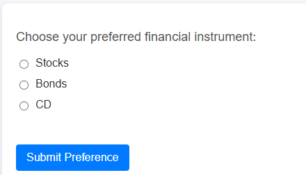

# 建立網路表單

已建立下列HTML表單以擷取使用者偏好設定


當使用者按一下網頁上的按鈕時，會擷取他們選取的財務偏好設定（例如「股票」、「債券」或CD）並將其推送至Adobe資料層。 此事件(assetClassSelection)會即時儲存使用者的選擇。 Adobe Launch接著會監聽此事件，擷取選取的投資選項(PreferredFinancialInstrument)，並可觸發動作，例如將資料傳送至Adobe Experience Platform (AEP)或更新個人化規則

下列JavaScript是用來處理表單提交的

```javascript
function handleSubmission() {
  window.adobeDataLayer = window.adobeDataLayer || [];

  const selectedAssetClass = document.querySelector('input[name="assetclass"]:checked');
  const errorMessage = document.getElementById("error-message");
  const messageBox = document.getElementById("message");

  if (!selectedAssetClass) {
    errorMessage.textContent = "Please select a financial instrument.";
    messageBox.textContent = "";
    return;
  }

  errorMessage.textContent = "";

  const subscriptionEvent = {
    event: "assetClassSelection",
    xdm: {
      eventType: "assetClassSelection",
      eventID: "investment_preference_event",
      timestamp: new Date().toISOString(),
      FinancialInterest: {
        PreferredFinancialInstrument: selectedAssetClass.value
      }
    }
  };

  console.log("📩 Sending asset class data to AEP:", subscriptionEvent);
  window.adobeDataLayer.push(subscriptionEvent);

  // ✅ Show thank-you message
  messageBox.textContent = `Thank you for selecting "${selectedAssetClass.value}". We'll use this to personalize your experience.`;
}
```

[本教學課程提供範例HTML表單](assets/webform.zip)
