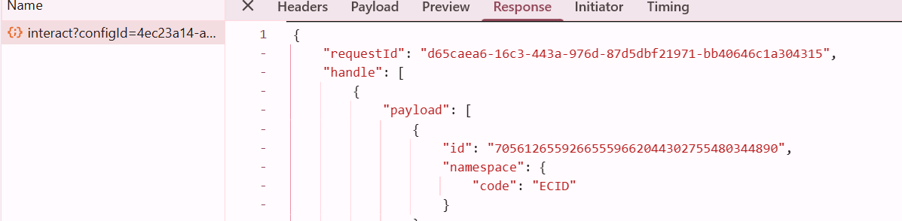
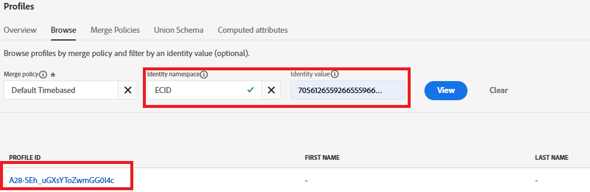
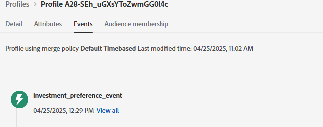

# 測試解決方案

若要驗證實施，請開啟包含偏好設定表單的網頁。 使用瀏覽器的DevTools （主控台和網路標籤）來監視表單提交程式。 提交偏好設定（例如，選取「庫存」）後，請確認AEP Web SDK (alloy.sendEvent)已成功觸發，且已將正確資料傳送至Adobe Experience Platform。 在AEP中，導覽至「對象」區段，並使用Edge Segmentation快速確認您的設定檔符合預期對象（例如「感興趣的股票」）資格。 您也可以檢查關聯資料集中的傳入事件資料，以確保它包含正確的偏好設定值。 對每個資產類別（股票、債券、CD）重複此程式，以確保完整的工作流程正常運作。

## 疑難排解提示

如果您沒有立即看到設定檔符合目標對象的資格，請確認下列事項：

### 驗證Adobe資料層推送

* 開啟瀏覽器的開發人員工具→主控台
* 輸入console.log(window.adobeDataLayer)；
* 確認具有事件「assetClassSelection」的事件和正確的PreferredFinancialInstrument值會在表單提交後顯示

### 確認Launch規則執行

* 開啟Adobe Experience Platform Debugger (Chrome擴充功能)
* 登入除錯工具
* 提交表單
* 確認已擷取assetClassSelection的DataPushed事件

下列除錯程式熒幕擷圖應該會對您有所幫助

### 取得ECID

ECID (Experience Cloud ID)是Adobe的永久性唯一識別碼，用於在Experience Cloud解決方案和工作階段中識別及統一使用者。

* Chrome開發人員工具→網路索引標籤

* 依「互動」或「收集」篩選

* 提交表單
* 按一下回應標籤，並記下ECID

### 檢查即時設定檔和對象資格

* 登入Journey Optimizer
* 前往客戶 — >設定檔 — >瀏覽
* 搜尋您在上一步取得的ECID，如熒幕擷圖所示
  
* 按一下設定檔並選取事件標籤，以檢查是否已列出investment_preference_event
  
* 開啟與事件相關聯的JSON，並檢查其是否包含正確的事件資料。

### 其他疑難排解提示

* 請確定結構描述和資料集設定檔已啟用。
* 確保對象已啟用Edge分段，以便近乎即時進行資格鑑定。
* 等候幾分鐘並重新整理對象檢視也很有幫助，尤其是在發佈變更後立即測試的情況下。
* 請確定對象規則已正確定義，並參考從表單提交中擷取的精確欄位名稱和值。
