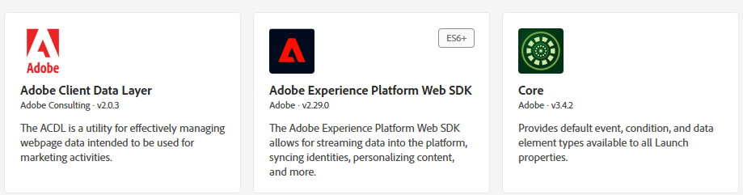
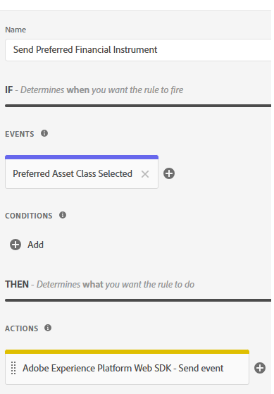

# 建立AEP標籤

Adobe Experience Platform Tags (先前稱為Adobe Launch)有助於在網站上管理和部署*行銷與分析技術，而不需要變更網站的程式碼。

此[影片說明建立Adobe Experience Tags的程式](https://experienceleague.adobe.com/zh-hant/playlists/experience-platform-get-started-with-tags)

* 登入資料收集
* 按一下「標籤 — >新增屬性」
* 建立稱為「財務建議程式」的Adobe Experience Platform標籤。

* 將下列擴充功能新增至標籤
  

* 請務必設定Adobe Experience Platform Web SDK以使用先前步驟中建立的正確環境和財務顧問資料流。
  

* Adobe Client Data Layer和核心擴充功能不需額外設定

## 建立資料元素

資料元素可用來透過網頁式行銷和廣告技術收集、組織和傳遞資料。

建立下列資料元素

| 元素名稱 | 擴充功能 | 資料元素型別 | 其他註解 |
|------------------------------|-----------------------------------|-------------------|------------------------------------------------------------------------------------------------------------------------------------------------------------------|
| 優先金融工具 | 核心 | 自訂程式碼 | 請參閱下列附註 |
| XDM 物件 | Adobe Experience Platform Web SDK | xdm物件 | 選取您的環境和財務顧問結構 |


針對自訂程式碼，開啟程式碼編輯器，並複製及貼上下列程式碼

```javascript
return window.adobeDataLayer
  ?.slice()
  .reverse()
  .find(event => event.event === "assetClassSelection")
  ?.xdm?.FinancialInterest?.PreferredFinancialInstrument || "undefined";
```

## 程式碼說明

檢視adobeDataLayer陣列（會儲存網頁上發生的事件）。

使用.slice()製作陣列的復本，這樣原始陣列就不會變更。

反轉事件的順序，先檢查最新的事件。

尋找event.event完全為「assetClassSelection」的第一個事件（從最新事件開始）。

如果找到，請進入該事件的xdm資料，並從FinancialInterest.PreferredFinancialInstrument取得值。

如果找不到任何內容，則傳回「未定義」字串，


## 建立規則

Adobe Experience Platform標籤中的規則產生器可讓您根據使用者行為或事件，定義特定動作在網站上執行的時間和方式。

* 建立名為「傳送偏好的金融工具」的規則。 此規則包含事件和動作


* 建立名為「選取的偏好資產類別」的事件設定，如下所示。 此事件會接聽assetClassSelection事件。
  


* 建立動作以將更新的XDM結構描述傳送至AEP
  

* 您的最終規則應該如下所示
  

## 建置和部署AEP標籤


建立新程式庫，並將所有已修改的資源新增至程式庫，如下面的熒幕擷取畫面所示。

新增程式庫


建立程式庫

在「建立程式庫」畫面中，指定程式庫名稱和環境。
您需要將所有變更的資源新增至此程式庫


然後按一下儲存並建置到開發按鈕以建置程式庫

## 在HTML頁面中加入AEP標籤

當您發佈AEP Tags屬性時，Adobe會為您提供指令碼標籤，您必須將該標籤置於HTML ``` <head>```內或``` <body>```標籤的底部。

* 前往您的Tags(Financial Advisors)屬性。

* 按一下環境，然後按一下所需環境的安裝圖示（例如開發、測試、生產）。

* 記下內嵌程式碼。 在本教學課程的稍後階段會用到它。

