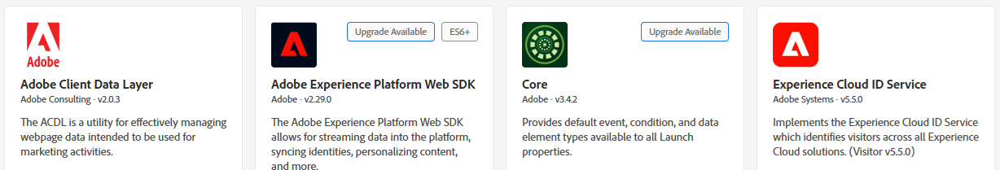
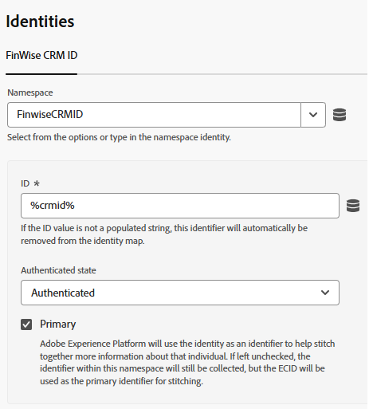
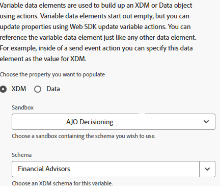
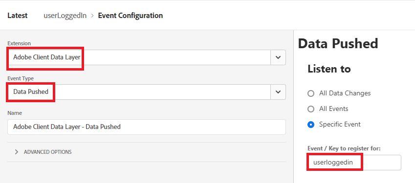
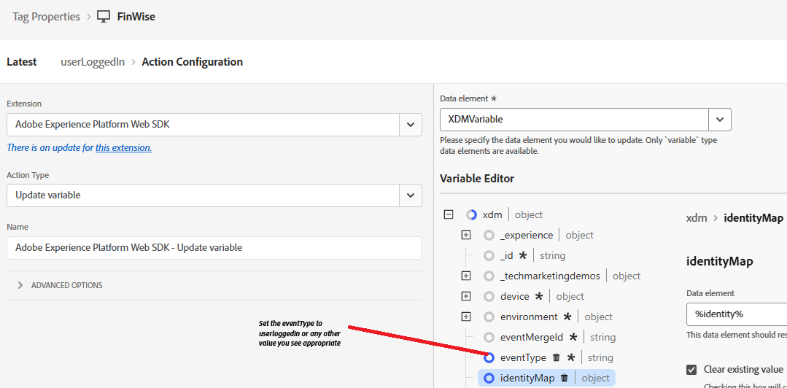
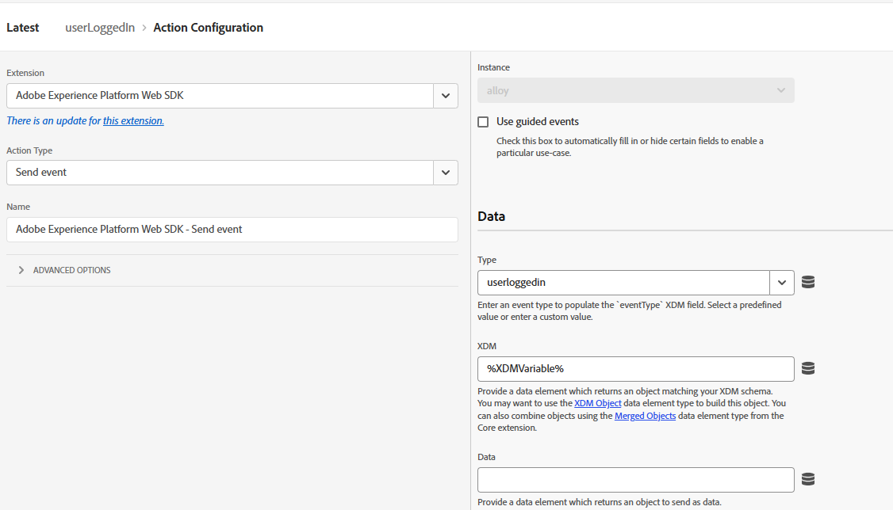

# 傳送CRMID至Adobe Experience Platform

Adobe Experience Platform Tags是用來將CRMID傳送至Adobe Experience Platform (AEP)，因為它提供靈活、事件導向的機制，以便直接從瀏覽器傳輸身分資料。 使用者登入後傳送CRMID可讓AEP將匿名ECID與已知CRM設定檔連結，以實現精確的身分拼接。 此連結構成在Adobe Journey Optimizer (AJO)中建立統一客戶設定檔、合格對象及提供即時個人化體驗的基礎。

已建立名為&#x200B;_**FinWise**_&#x200B;的Experience Platform Tags屬性。 已將下列擴充功能新增至Tags屬性

使用在上一步建立的Financial Advisors DataStream，設定AEP Web SDK擴充功能。
Experience Cloud ID Service是新增至標籤屬性的選用擴充功能，以供除錯之用。

## 標籤資料元素

建立下列資料元素

| 資料元素 | 擴充功能 | 資料元素型別 | 自訂設定 |
|--------------|-----------------------------------|---------------------------|----------------------------------------|
| crmid | Adobe使用者端資料層 | 資料層計算狀態 | user.crmid |
| ECID | Experience Cloud ID 服務 | ECID |                                        |
| 身分識別 | Adobe Experience Platform Web SDK | 身分對應 |  |
| XDMVariable | Adobe Experience Platform Web SDK | 變數 |  |

## 建立規則

使用下列事件和動作建立名為userLoggedin的規則

事件

更新變數動作

傳送事件動作

## 儲存並建置

儲存變更、建立及建置程式庫。
