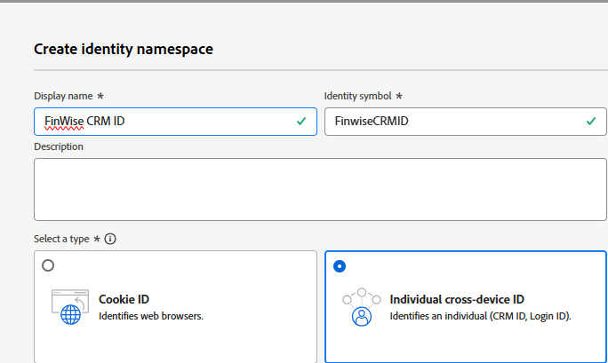
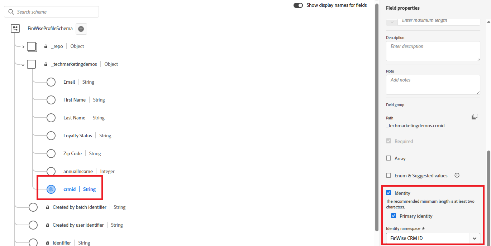
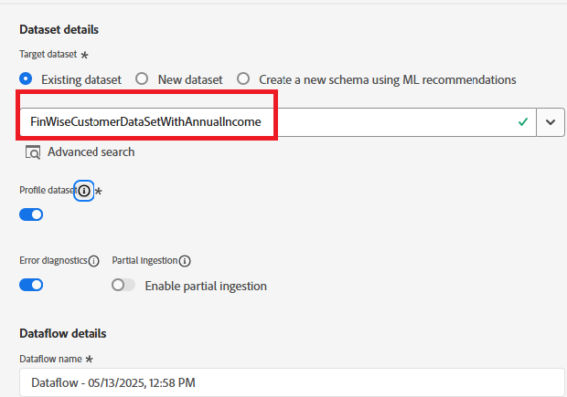
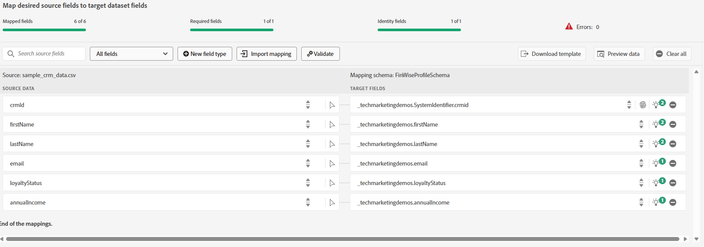
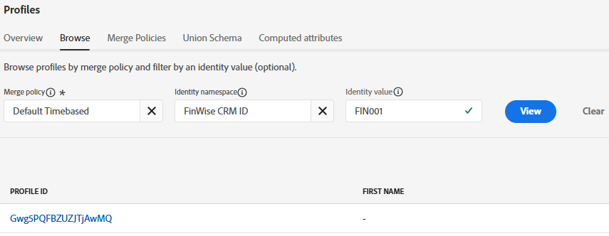

# 將範例CRM資料匯入AEP設定檔資料集

若要開始身分拼接，請將範例CRM設定檔資料匯入繫結至Adobe Experience Platform中啟用設定檔的結構描述的資料集

## 建立自訂名稱空間

* 導覽至「客戶 — >身分 — >建立身分名稱空間」
* 選取個別跨裝置ID，並提供顯示名稱和身分符號，如下方熒幕擷取畫面所示。
  

## 建立已啟用設定檔的結構描述

建立名為&#x200B;**_FinWiseProfileSchema_**的個別設定檔結構描述。 包含annualIncome、email、firstName、lastName和loyaltyStatus等欄位。
在SystemIdentifier物件下新增識別欄位**_crmid_**。 將crmid欄位標示為身分和主要

## 準備範例資料

| crmId | 名字 | 姓氏 | 電子郵件 | loyaltyStatus | 年收入 |
|--------|-----------|----------|---------------------------|---------------|--------------|
| FIN001 | Alice | 黃 | alice.wong@example.com | 金級 | 336104 |
| FIN002 | Brian | Smith | brian.smith@example.com | 銀級 | 191065 |
| FIN003 | Cathy | Johnson | cathy.johnson@example.com | 銅級 | 117015 |
| FIN004 | David | 李 | david.lee@example.com | 銅級 | 61869 |
| FIN005 | Eva | 馬丁內斯 | eva.martinez@example.com | 銀級 | 191371 |
| FIN006 | Frank | 棕色 | frank.brown@example.com | 銀級 | 196132 |
| FIN007 | 寬限期 | Kim | grace.kim@example.com | 金級 | 309851 |
| FIN008 | Henry | 戴維斯 | henry.davis@example.com | 金級 | 318378 |
| FIN009 | 艾拉 | 克拉克 | isla.clark@example.com | 銀級 | 181776 |
| FIN010 | 傑克 | 洛佩茲 | jack.lopez@example.com | 銀級 | 186643 |

## 擷取CSV檔案

* 根據先前步驟建立的&#x200B;**_FinWiseProfileSchema_**，建立名為&#x200B;**_FinWiseCustomerDataSetWithAnnualIncome_**&#x200B;的資料集

* 導覽至連線 — >來源 — >本機系統
* 選取本機檔案上傳下的&#x200B;**_新增資料_**。 請務必選取&#x200B;_**FinWiseCustomerDataSetWithAnnualIncome**_作為目標資料集。
  
* 導覽至下一個畫面。 上傳[csv檔案](assets/sample_crm_data.csv)並驗證對應
  

* 按一下完成，即可開始資料擷取程式

## 驗證設定檔

* 導覽至客戶 — >設定檔並搜尋等於FIN001或任何其他有效值的FinWise CRM ID
  
