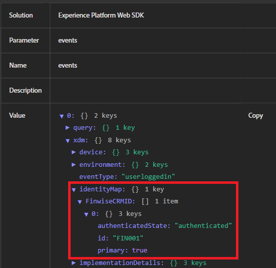

# 測試身分拼接

此範例應用程式會模擬真實世界的登入流程，在將CRM ID傳送至Adobe Experience Platform (AEP)之前，使用者憑證會在伺服器端驗證。 本機Node.js伺服器可用來安全地提供網頁、處理基本驗證邏輯，以及避免可能會干擾Adobe Launch或網頁SDK功能的瀏覽器限制（例如封鎖的本機檔案存取或遺失CORS標題）。 此設定可確保體驗更接近真實的生產環境。

## 安裝節點.js

如果您尚未安裝Node.js，請從這裡](https://nodejs.org/)下載並[安裝

執行以驗證安裝：

`node -v`

`npm -v`

## 設定專案資料夾

使用下列命令為範例應用程式建立新目錄

`mkdir aep-demo`

`cd aep-demo`

## 初始化專案

`npm init -y`

## 安裝Express （Web伺服器架構）

`npm install express`

## 建立server.js檔案

```javascript
const express = require('express');
const path = require('path');
const app = express();
const PORT = 3000;

// Serve static files from the current directory
app.use(express.static(__dirname));

app.listen(PORT, () => {
  console.log(`Server is running at http://localhost:${PORT}`);
});
```

## 新增HTML/Assets

將提供的所有[HTML和CSS檔案](assets/login-app-files.zip)複製到此資料夾。 複製AEP Tags指令碼並貼到index.html檔案的`<head>`區段內。

## 執行伺服器

`node server.js`

## 測試

開啟`http://localhost:3000` url。 登入使用alice/pass123

## 使用AEP Debugger

Adobe Experience Platform Debugger是功能強大的瀏覽器擴充功能，可協助驗證從您的網站傳送到Adobe Experience Platform的資料。 在檢查identityMap是否已正確設定並透過Adobe Web SDK (alloy.js)傳輸時，此外掛程式特別實用。

使用AEP Debugger測試登入事件、驗證身分拼接（例如傳遞的ECID和CRMID），以及確保AEP標籤規則和資料元素如預期引發。 它可即時顯示傳出事件、身分資訊和XDM裝載，這對於疑難排解設定檔擴充和受眾資格至關重要。

以下熒幕擷取畫面顯示正確傳遞ID &quot;FIN001&quot;。


## 在AEP中驗證身分拼接的步驟

* 登入AEP
* 導覽至「客戶 — >設定檔 — >瀏覽」
* 搜尋FinWise CRM ID = FIN001
* 開啟設定檔，然後檢視身分割槽段。 您應該會看到CRMID和ECID同時列出。   這可確認兩個身分已拼接到單一設定檔。


