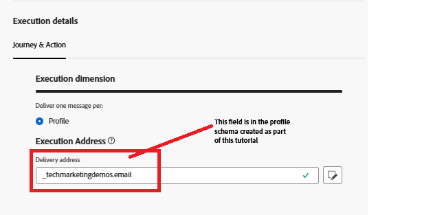
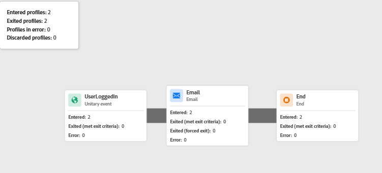

# 使用Adobe Web SDK觸發Adobe Journey Optimizer歷程

在身分拼接教學課程的這個擴充功能中，會觸發Adobe Journey Optimizer歷程，利用登入使用者拼接的設定檔向其傳送電子郵件。 **本文假設您熟悉電子郵件頻道，並為電子郵件頻道建立內容。**

## 建立電子郵件通道設定

* 登入&#x200B;_**Journey Optimizer**_
* 瀏覽至&#x200B;_**管理 — >管道 — >建立管道設定**_
* 從頻道清單中選取&#x200B;**電子郵件**。 提供有意義的名稱和說明。
* 填寫電子郵件設定。
* 提供執行詳細資料，如下所示。 電子郵件會傳送到儲存在欄位中的設定檔電子郵件地址
* 
* 啟動電子郵件通道設定

## 建立事件

* 登入&#x200B;_**Journey Optimizer**_
* 瀏覽至&#x200B;_**管理 — >設定**_
* 按一下事件卡片的管理按鈕，然後按一下建立事件。 指定下列值
* 

* 檢查事件的eventType是否等於LoginEvent。 已在Adobe Experience Platform標籤中設定`LoginEvent`型別。
* 儲存事件

## 建立歷程

* 登入&#x200B;_**Journey Optimizer**_
* 導覽至&#x200B;_**歷程管理 — >歷程 — >建立歷程**_
* 將&#x200B;_**UserLoggedIn**_&#x200B;事件拖放到畫布上
* 從動作功能表拖放電子郵件。 設定電子郵件動作，以使用先前建立的電子郵件通道設定。
* 發佈歷程。

## 歷程的觸發方式

當透過網頁SDK傳送的事件裝載符合歷程中的設定時，就會觸發歷程。 在此範例中，事件是`UserLoggedIn`，事件型別是`LoginEvent`。

* 檢視歷程報告以驗證此
* 

