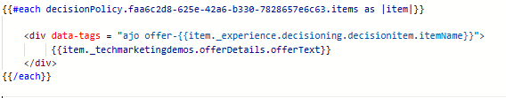

# 建立行銷活動

為了將個人化優惠方案提供給網頁上的使用者，已在Adobe Journey Optimizer中建立行銷活動，並設定正確的頻道、Web頻道。 此設定可確保透過即時決策將優惠提供給與網站互動的使用者。

在此行銷活動中，已定義決定原則來控制如何選取優惠。 決策原則包含選擇策略，該策略包含：

優惠專案的集合（例如，根據郵遞區號或收入），

決定哪些優惠方案適用於使用者的適用性規則，以及

一種排名公式，可將分數指派給合格的優惠方案，以排定最相關優惠方案的優先順序。

登入的使用者造訪網站時，系統會傳送個人化要求給AJO。 決策政策會根據使用者的拼接身分和設定檔屬性（例如郵遞區號和年收入），評估所有可用的優惠方案。 它會套用選擇策略和排名邏輯來判斷最佳符合。

結果是一組量身打造的優惠方案，會以HTML內容的形式傳回，並在網站上的輪播中向使用者顯示，建立順暢的即時個人化體驗。

## 在AJO中建立行銷活動的高階步驟

1. **建立通道設定**\
   定義選件的顯示位置及方式（例如具有程式碼型體驗的網頁）。
   - **名稱**： `finwise-web-personalization`\
     為FinWise的個人化Web選件傳遞識別此設定。

   - **平台**： `Web`\
     專門針對網頁瀏覽器。 未啟用任何行動裝置頻道。

   - **體驗型別**： `Code-based experience`\
     選件不會直接插入至DOM。 AJO而是會傳回原始HTML，並使用自訂JavaScript進行剖析。

   - **頁面URL**： `http://localhost:3000/formula.html`\
     此管道針對開發期間使用的特定測試頁面進行設定。

   - **在頁面**&#x200B;上的位置： `offers-div`\
     系統使用前端邏輯動態剖析傳回的選件，並將其演算至此容器。

   - **內容格式**： `HTML`\
     選件會以原始HTML片段傳送，以便完整控制選件的樣式、篩選和顯示方式。

2. **開始新的行銷活動**\
   導覽至「行銷活動」區段，並使用Web頻道建立新的行銷活動。

3. **新增動作**\
   新增程式碼型體驗動作，並將動作連結至先前建立的通道設定。

4. **客群**\
   所有訪客（預設）。

   身分型別：ECID (Experience Cloud ID)
此設定使用ECID作為主要身分來辨識使用者。 當身分拼接就緒時，ECID會連結至Personalized Targeting的CRM ID。選取或建立定義優惠邏輯的決策原則。

5. **決定原則**

   此動作連結至&#x200B;**決定原則**，該原則定義如何選取優惠以及傳回多少優惠以供顯示。 此原則使用先前在教學課程中建立的&#x200B;**選取策略**。

   選擇策略是&#x200B;**以公式為基礎**，這表示它使用排名公式將分數指派給合格的優惠方案，並決定哪些優惠方案應優先處理。

   策略包括：

   - **優惠收藏**\
     與促銷活動相關的一組預先定義的優惠，例如郵遞區號特定或收入型優惠。

   - **適用性規則**\
     適用性已設定為&#x200B;**_所有訪客_**

   - **排名公式**\
     對每個合格優惠進行評分的邏輯運算式。 分數最高的優惠方案會在個人化體驗中呈現。

6. **插入決定原則**

   

   Handlebars程式碼會在Adobe Journey Optimizer中循環執行特定決定原則傳回的優惠，並為每個優惠建立`
`。 每個`
`都使用具有優惠方案內部名稱的資料標籤屬性，以協助輪播群組並依類別組織優惠方案，以順暢導覽。 每個`
`內的內容會顯示個人化優惠方案文字，以動態且視覺化的方式呈現多個優惠方案。

7. **發佈行銷活動**\
   啟動行銷活動，開始即時提供個人化優惠。

