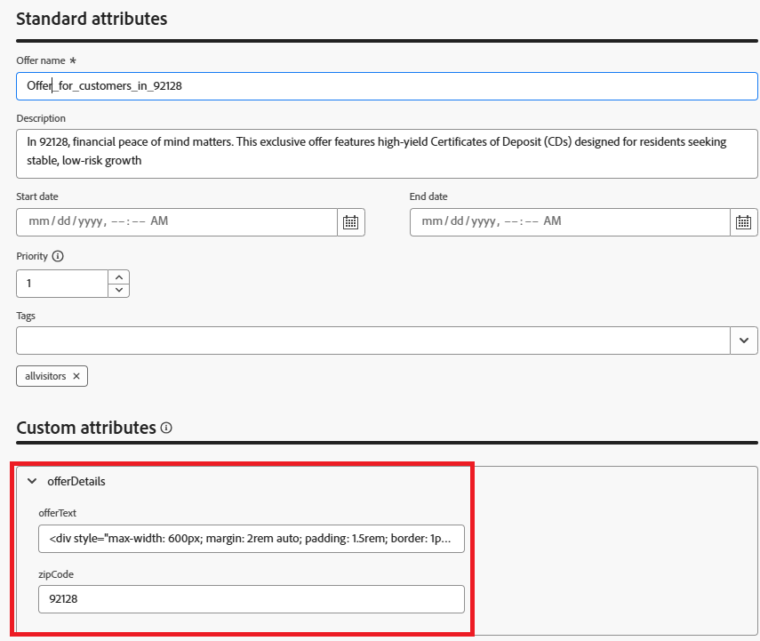

# 使用郵遞區號鎖定目標建立以位置為基礎的優惠方案

建立優惠方案之前，優惠方案專案結構描述已擴充為包含新欄位：郵遞區號。 此自訂欄位可讓每個選件明確標示其目標郵遞區號，以便在決策期間根據位置進行篩選和排名。

更新結構描述後，建立了兩個個人化優惠方案：

* 優惠方案1：「Mira Mesa (92126)的彈性投資計畫」
這項優惠專為92126國年輕的專業人士和以技術為重點的居民量身打造，旨在促進彈性投資選擇，例如ETF和共同基金，以達成長期增長。 郵遞區號欄位設為92126。

* 選件2：「蘭喬貝納多的高產量CD (92128)」
此服務以92128中財務上穩定且準備好退休的個人為目標，提供具保證回報的高收益存款證(CD)。 郵遞區號欄位設為92128。

這些優惠現在已透過位置中繼資料更加豐富，因此符合資格在後續步驟中根據使用者設定檔郵遞區號進行動態選擇和排名。

下列熒幕擷圖顯示新增至優惠方案專案結構描述的自訂屬性。




## 適用於92126的選件

郵遞區號中優惠方案92126優惠方案文字

```html
<div style="max-width: 600px; margin: 2rem auto; padding: 1.5rem; border: 1px solid #ddd; border-radius: 12px; font-family: Arial, sans-serif; background-color: #f9f9f9; box-shadow: 0 4px 12px rgba(0,0,0,0.05);">   <h2 style="color: #1a237e; font-size: 1.5rem; margin-bottom: 0.5rem;">     Boost Your Financial Game with Smart Investment Options   </h2>   <p style="color: #333; font-size: 1rem; line-height: 1.6;">     In Mira Mesa (92126), ambition meets opportunity. Whether you're building wealth or just getting started, our     <strong>diversified investment plans</strong> — including <strong>tech-focused ETFs</strong> and     <strong>flexible mutual funds</strong> — are designed to grow with your goals.   </p>   <p style="color: #333; font-size: 1rem; line-height: 1.6;">     Enjoy expert guidance, low fees, and strategies built for busy professionals who want more from their money — without the hassle.   </p>   <a href="#start-investing" style="display: inline-block; margin-top: 1rem; background-color: #1a73e8; color: white; padding: 0.75rem 1.25rem; border-radius: 8px; text-decoration: none; font-weight: bold;">     Start Investing Smarter   </a> </div>
```


## 適用於92128的選件

郵遞區號中優惠方案92128優惠方案文字

```html
<div style="max-width: 600px; margin: 2rem auto; padding: 1.5rem; border: 1px solid #ddd; border-radius: 12px; font-family: Arial, sans-serif; background-color: #fdfdfd; box-shadow: 0 4px 12px rgba(0,0,0,0.05);">   <h2 style="color: #1a237e; font-size: 1.5rem; margin-bottom: 0.5rem;">     Grow Your Savings with Confidence – Exclusive CD Rates for 92128   </h2>   <p style="color: #333; font-size: 1rem; line-height: 1.6;">     Live in Rancho Bernardo? Take advantage of your financial momentum with our <strong>high-yield Certificates of Deposit</strong>, offering up to <strong>5.25% APY</strong>.     Designed for peace of mind and smart growth, our flexible CD options let you lock in guaranteed returns while enjoying the stability you deserve.   </p>   <p style="color: #333; font-size: 1rem; line-height: 1.6;">     Whether you're planning retirement or simply securing your future, this offer is tailored for residents like you.   </p>   <a href="#explore-cd-options" style="display: inline-block; margin-top: 1rem; background-color: #1a73e8; color: white; padding: 0.75rem 1.25rem; border-radius: 8px; text-decoration: none; font-weight: bold;">     Explore CD Options   </a> </div>
```

## 通用選件（遞補選件）

一般優惠方案的優惠方案文字，不含任何與優惠方案相關聯的郵遞區號

```html
<div style="max-width: 600px; margin: 2rem auto; padding: 1.5rem; border: 1px solid #ddd; border-radius: 12px; font-family: Arial, sans-serif; background-color: #ffffff; box-shadow: 0 4px 12px rgba(0,0,0,0.05);">
  <h2 style="color: #1a237e; font-size: 1.5rem; margin-bottom: 0.5rem;">
    Invest Smarter: Build Wealth with Flexible Financial Plans
  </h2>
  <p style="color: #333; font-size: 1rem; line-height: 1.6;">
    Looking to take control of your financial future? Our flexible investment solutions are designed to meet a wide range of goals — from growing savings to planning for retirement.
    Choose from diversified mutual funds, ETFs, and professionally managed portfolios, all with expert guidance and minimal hassle.
  </p>
  <p style="color: #333; font-size: 1rem; line-height: 1.6;">
    Whether just starting out or optimizing an existing strategy, this offer provides the tools to invest with confidence — no matter where you live.
  </p>
  <a href="#explore-investment-plans" style="display: inline-block; margin-top: 1rem; background-color: #1a73e8; color: white; padding: 0.75rem 1.25rem; border-radius: 8px; text-decoration: none; font-weight: bold;">
    Explore Investment Plans
  </a>
</div>
```

將這些優惠方案群組在名為&#x200B;**收入相關優惠方案**&#x200B;的集合中

所有訪客都可以使用選件，這表示沒有嚴格的資格限制，而排名公式變得至關重要，可根據設定檔內容決定應顯示哪個選件。
由於適用性規則不會篩選優惠方案，因此這三者都會被視為適用者。
選取策略會擷取所有這三個專案。
排名公式會根據設定檔屬性（例如zipcode和annualIncome）來評分，以挑選最佳設定檔。
