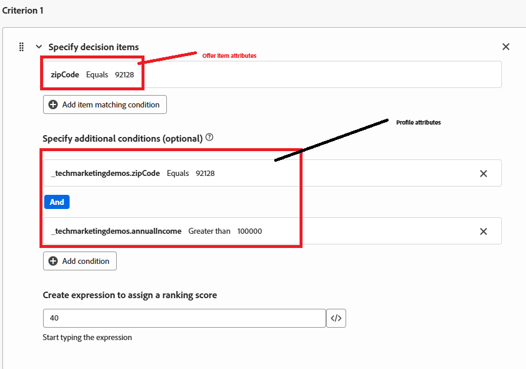
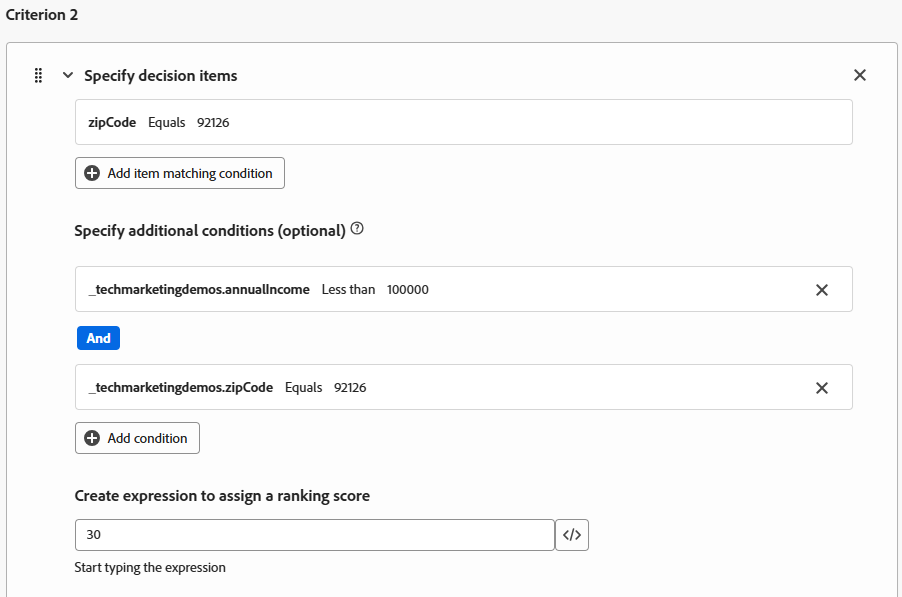

# 建立排名公式

Adobe Journey Optimizer中的排名公式會在Offer Decisioning期間使用，尤其是在選取策略中，用來決定合格優惠方案的優先順序。 適用性篩選之後，排名公式就會開始起作用，當多個優惠符合指定設定檔的資格時，但應根據商業邏輯或設定檔內容只顯示前一個（或少數個）。

* 登入Journey Optimizer

* 決策 — >策略設定 — >排名公式 — >建立公式

排名公式

排名公式中的條件是指用於將分數指派給優惠方案的條件規則。 這些條件會比較優惠方案與設定檔或內容的屬性，以判斷優惠方案與特定個人的相關性。

條件1

條件1包含三個條件：

* 選件。_techmarketingdemos.offerDetails.zipCode == &quot;92128&quot; — 檢查與選件相關聯的郵遞區號。

* _techmarketingdemos.zipCode == &quot;92128&quot; — 檢查使用者設定檔上的郵遞區號。

* _techmarketingdemos.annualIncome > 100000 — 檢查使用者設定檔的收入層級。

如果符合所有這些條件，選件會得到40分。

條件2

條件2包含三個條件：

* 選件。_techmarketingdemos.offerDetails.zipCode == &quot;92126&quot; — 檢查與選件相關聯的郵遞區號。

* _techmarketingdemos.zipCode == &quot;92126&quot; — 檢查使用者設定檔上的郵遞區號。

* _techmarketingdemos.annualIncome &lt; 100000 — 檢查使用者設定檔的收入層級。

如果符合所有這些條件，選件會獲得30分。

