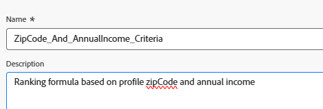
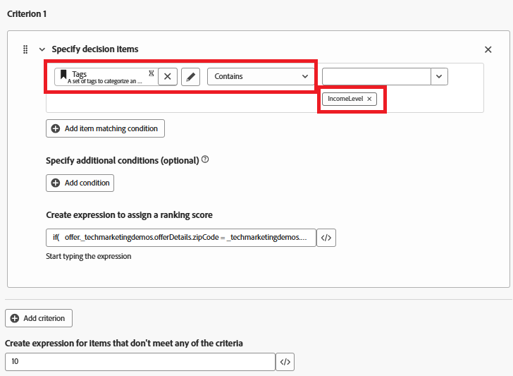

# 建立排名公式

Adobe Journey Optimizer中的排名公式會在Offer Decisioning期間使用，尤其是在選取策略中，用來決定合格優惠方案的優先順序。 適用性篩選之後，排名公式就會開始起作用，當多個優惠符合指定設定檔的資格時，但應根據商業邏輯或設定檔內容只顯示前一個（或少數個）。

* 登入Journey Optimizer

* 決策 — >策略設定 — >排名公式 — >建立公式

排名公式


排名公式中的條件是指用於將分數指派給優惠方案的條件規則。 這些條件會比較優惠方案與設定檔或內容的屬性，以判斷優惠方案與特定個人的相關性。


條件1

此條件會篩選決定專案（優惠方案） **以僅包含**標示為「IncomeLevel」的優惠方案。
接著，系統會根據您定義的其他邏輯，繼續下一步驟（例如排名或傳送）。



下列運算式可用來建立排名分數

```pql
if(   offer._techmarketingdemos.offerDetails.zipCode = _techmarketingdemos.zipCode,   _techmarketingdemos.annualIncome / 1000 + 10000,   if(     not offer._techmarketingdemos.offerDetails.zipCode,     _techmarketingdemos.annualIncome / 1000,     -9999   ) )
```

公式的作用

* 如果優惠方案與使用者有相同的郵遞區號，請將分數設定為非常高，系統就會先挑選優惠方案。

* 如果優惠完全沒有郵遞區號（這是一般優惠方案），請根據使用者的收入給予正常分數。

* 如果優惠方案的郵遞區號與使用者不同，請將分數設定為非常低，以免選取優惠方案。

如此一來，系統：

* 一律先嘗試顯示郵遞區號相符的選件，

* 如果找不到相符專案，則會回覆為一般選件，並避免顯示專供其他郵遞區號使用的選件。


如果優惠方案專案不符合任何篩選條件（例如沒有「IncomeLevel」標籤），優惠方案會收到10的預設排名分數。


