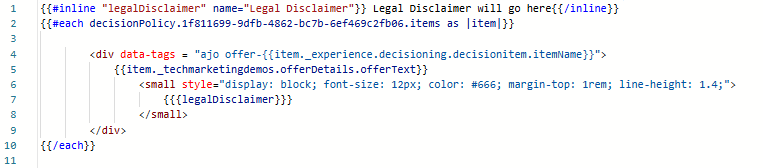
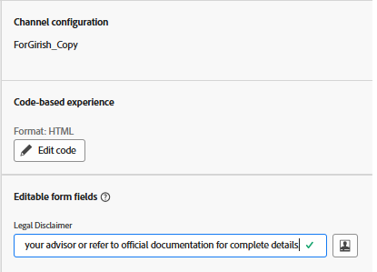

# 在AJO程式碼型體驗中使用可編輯的表單欄位

在許多行銷歷程中，尤其是在法規管制的產業，包含法律免責宣告是很重要的，這些免責宣告會因行銷活動、地理區域或產品而異。 透過直接在AJO Personalization編輯器中使用[可編輯欄位](https://experienceleague.adobe.com/zh-hant/docs/journey-optimizer-learn/tutorials/channels/code-based-experience-channel/form-fields-in-code-based-experiences)，行銷人員和法律團隊可以保持對免責宣告文字的完整控制，而不需要涉及開發人員或修改決定邏輯。

如此可快速更新並確保跨行銷活動的合規性，同時運用優惠方案等決策式內容。

## 在個人化編輯器中插入可編輯欄位

- 開啟在先前步驟中建立的行銷活動。
- 按一下&#x200B;_&#x200B;**修改行銷活動**&#x200B;_
- 導覽至&#x200B;_&#x200B;**內容**&#x200B;_&#x200B;索引標籤
- 按一下&#x200B;_&#x200B;**編輯代碼**&#x200B;_，並在個人化編輯器中使用下列語法，以預設值插入名為legalDisclaimer的可編輯欄位

- `{{#inline "legalDisclaimer" name="Legal Disclaimer"}} Legal Disclaimer will go here {{/inline}}`

- 在範本中使用`{{{legalDisclaimer}}}`變數，如下所示

- 

- 行銷人員可以輕鬆編輯法律免責宣告欄位，而無須開啟個人化編輯器。
- 

## 發佈此行銷活動

啟動行銷活動，開始即時提供個人化優惠。
