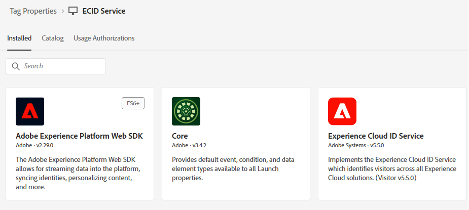

# 建立Adobe Experience Platform標籤

在網頁上設定Experience Platform標籤來載入Adobe Experience Platform Web SDK，啟用sendEvent API呼叫以觸發個人化體驗。 此設定可確保正確初始化必要的使用者端程式庫，進而允許與Adobe Journey Optimizer即時互動，以進行選件傳送。

1. 登入資料彙集。
1. 按一下&#x200B;**[!UICONTROL 標籤]** > **[!UICONTROL 新增屬性]**。
1. 建立名為ECID服務的Adobe Experience Platform標籤。
1. 將下列擴充功能新增至標籤：

   

1. 設定Adobe Experience Platform Web SDK，使用先前教學課程中建立的正確環境和Financial Advisors DataStream

   

Adobe Client Data Layer和核心擴充功能不需額外設定

## 建立資料元素

Experience Platform標籤中的ECID資料元素是專為除錯和測試目的而建立。 資料元素可讓開發人員檢視指派給使用者瀏覽器工作階段的Experience Cloud ID，這有助於驗證身分拼接，並確保`sendEvent`呼叫與正確的設定檔相關聯。 個人化運作不需要此元素，但在實作和QA期間相當實用


## 在HTML頁面中加入AEP標籤

建置並發佈Adobe Experience Platform標籤。

發佈AEP Tags屬性時，Adobe會提供指令碼標籤，您必須將其置於HTML ``` <head>```內或``` <body>```標籤的底部。

1. 前往您的標籤（ECID服務）屬性。

1. 按一下環境，然後按一下所需環境的安裝圖示（例如，開發、測試、生產）。

1. 記下內嵌程式碼。

   此程式碼需要放置在HTML頁面中的結束```</body>```標籤之前。
