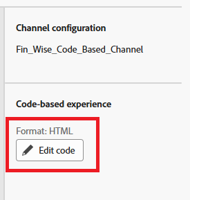

# 建立行銷活動

在Adobe Journey Optimizer (AJO)中，行銷活動會作為容器，將傳送個人化體驗給目標對象所需的所有元素彙整在一起。 它協調優惠何時顯示、如何顯示，以及連結管道、位置、集合和決定策略等元件。

1. 登入Journey Optimizer。
1. 按一下&#x200B;**[!UICONTROL 歷程管理]** > **[!UICONTROL 行銷活動]** > **[!UICONTROL 建立行銷活動]** > **[!UICONTROL 排程行銷]**。
1. 選取&#x200B;**[!UICONTROL 程式碼型體驗]**&#x200B;動作，然後選取在先前步驟中建立的組態。
1. 按一下&#x200B;**[!UICONTROL 編輯內容]**。

   

1. 若要開啟個人化編輯器，請按一下[編輯程式碼]。****

   

   個人化編輯器是非視覺體驗建立介面，可讓您編寫程式碼。
