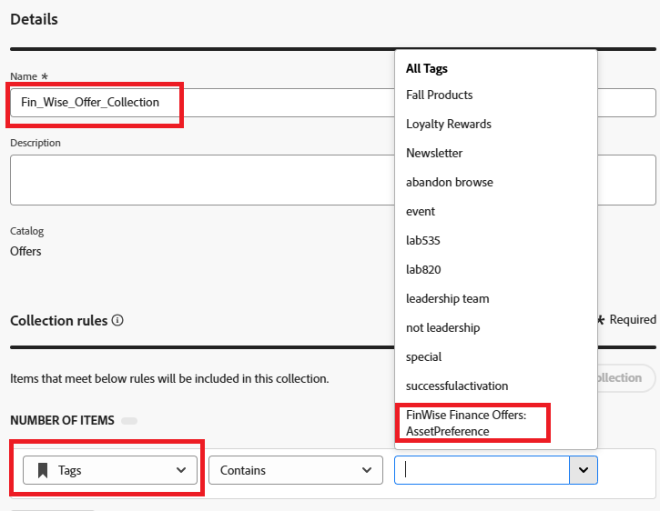

# 建立集合

集合可讓您根據自己的喜好對決定項目進行分類和分組。 這些類別是透過制定利用決定項目屬性的規則所建立的。

1. 登入Journey Optimizer。
1. 按一下&#x200B;**[!UICONTROL 決策]** > **[!UICONTROL 目錄]** > **[!UICONTROL 集合]** > **[!UICONTROL 建立集合]**。
1. 如下列熒幕熱點所示，指定集合名稱和集合規則。

   
