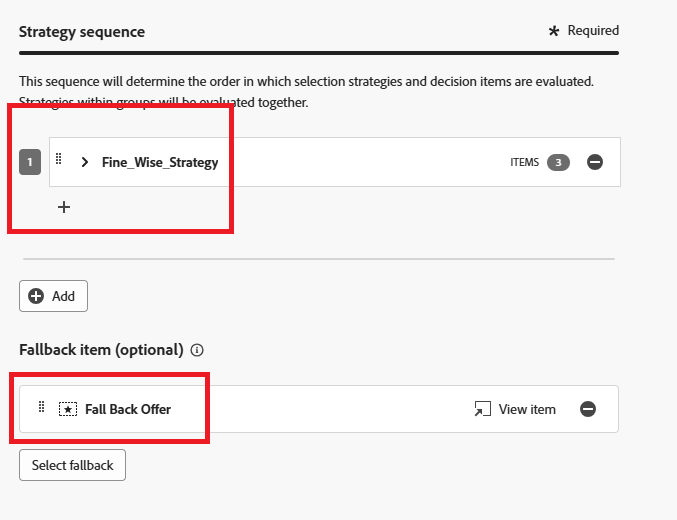
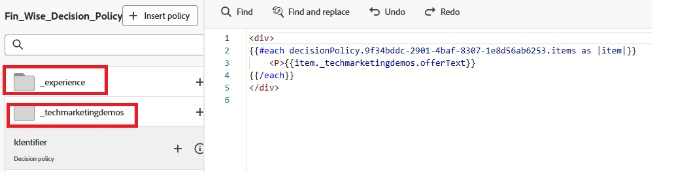

# 建立決定原則

決策原則是您優惠方案的容器，可運用[!UICONTROL 決策]引擎，根據對象挑選最佳內容進行傳遞。

1. 在個人化編輯器中，按一下左側導覽中的&#x200B;**[!UICONTROL 決定原則]**&#x200B;專案，然後按一下&#x200B;**[!UICONTROL 新增決定原則]**。

   

1. 按一下&#x200B;**[!UICONTROL 新增]**&#x200B;以選取選取策略。

   

1. 按一下&#x200B;**[!UICONTROL 選取遞補]**&#x200B;以選取遞補優惠。
1. 按一下&#x200B;**[!UICONTROL 下一步]**&#x200B;以檢閱決定原則。
1. 按一下[建立&#x200B;**&#x200B;**]完成建立決定原則的程式。

## 在程式碼編輯器中使用決定原則

1. 在個人化編輯器中，按一下&#x200B;**[!UICONTROL 插入原則]**。

   已新增與決定原則對應的程式碼。

   在此階段，您可以直接在程式碼中包含任何必要的決定屬性。 這些屬性是在優惠方案目錄使用的結構描述中定義。 標準屬性是在`__experience`名稱空間下組織，而貴組織專屬的任何自訂屬性都儲存在`_<imsOrg>`名稱空間下。

   

   此程式碼會瀏覽為使用者選擇的個人化優惠清單，並在網頁上顯示每個優惠的文字。 它會顯示段落中每個選件的訊息（稱為`offerText`），讓使用者可以清楚看到他們自訂的內容。

   如果沒有可用的個人化優惠方案，則會顯示遞補優惠方案，以確保空間不會留空。

1. 按一下&#x200B;**[!UICONTROL 儲存]**，然後啟動行銷活動。
