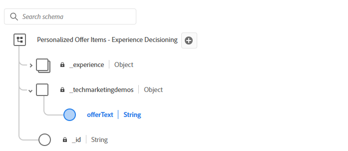

# 建立產品建議

AJO中的優惠方案專案代表單一個人化內容。 內容可以是根據決策邏輯傳送給使用者的促銷活動、訊息或建議。

當您在AJO中建立選件專案時，該專案必須以[!UICONTROL 決策結構描述]為基礎。 此結構描述會定義選件中可用的結構和欄位，例如標題、說明、imageURL、offerText等。

此結構描述：

* 標準化集合中所有優惠方案的內容模型。

* 允許跨優惠方案專案使用一致的個人化欄位。

* 啟用選取策略以將規則與結構化內容相符

## 修改架構

1. 登入Journey Optimizer。
1. 按一下&#x200B;**[!UICONTROL 決策]** > **[!UICONTROL 目錄]** > **[!UICONTROL 編輯結構描述]**。
1. 新增名為`offerItem`的型別`string`的元素，如下所示

   

## 建立優惠方案專案

1. 按一下&#x200B;**[!UICONTROL 決策]** > **[!UICONTROL 目錄]** > **[!UICONTROL 建立專案]**。

1. 建立三個選件： `Love Stocks`、`Love Bonds`和`Love CD`。

   對於每個優惠方案，將本文結尾提供的對應優惠方案文字複製並貼到適當的優惠方案專案中。

1. 使用上一步中建立的標籤來標籤選件。

1. 核准優惠方案。

已定義標準和自訂屬性的完成選件：


**熱門股票優惠文字**

```html
<div style="font-family: Arial, sans-serif; background-color: #f9f9f9; border: 1px solid #ddd; padding: 1.5rem; border-radius: 8px; max-width: 600px; margin: auto;">   <h3 style="color: #1a73e8; margin-top: 0;">📈 Open a Stock Trading Account & Get $100 in Bonus Stock</h3>   <p style="font-size: 1rem; color: #333;">     Ready to start building your portfolio? Open a new stock trading account with us and receive a      <strong>$100 bonus in stock</strong> — on us.   </p>   <ul style="padding-left: 1.25rem; color: #444;">     <li>🧾 No account minimums — start investing with as little as $1</li>     <li>📉 $0 commissions on online stock trades</li>     <li>📊 Access to powerful trading tools and real-time analytics</li>     <li>🎓 Free educational resources to help you invest confidently</li>   </ul>   <p style="color: #333;">     It's never been easier to start trading. Join thousands of investors who trust us to help them grow their wealth.   </p>   <a href="https://yourbrokerage.com/open-account"      style="display: inline-block; margin-top: 1rem; padding: 0.75rem 1.5rem; background-color: #1a73e8; color: white; text-decoration: none; border-radius: 5px; font-weight: bold;">      🚀 Open Your Account Today   </a> </div>
```

**愛情債券優惠文字**

```html
<div style="font-family: Arial, sans-serif; background-color: #f9f9f9; border: 1px solid #ddd; padding: 1.5rem; border-radius: 8px; max-width: 600px; margin: auto;">   <h3 style="color: #6c757d; margin-top: 0;">🏦 Invest in Stability: Explore Our Premium Bond Options</h3>   <p style="font-size: 1rem; color: #333;">     Looking for consistent income with lower risk? Our carefully selected bonds offer predictable returns and help balance your investment portfolio.   </p>   <ul style="padding-left: 1.25rem; color: #444;">     <li>📉 Lower volatility than stocks — ideal for income-focused investors</li>     <li>💵 Earn interest payments monthly, quarterly, or annually</li>     <li>🔍 Choose from government, municipal, or corporate bonds</li>     <li>🎁 Open a bond investment account today and receive a <strong>$50 interest credit</strong></li>   </ul>   <p style="color: #333;">     Whether you're preparing for retirement or just want a reliable stream of income, bonds offer a solid foundation for your financial strategy.   </p>   <a href="https://yourfirm.com/open-bond-account"      style="display: inline-block; margin-top: 1rem; padding: 0.75rem 1.5rem; background-color: #6c757d; color: white; text-decoration: none; border-radius: 5px; font-weight: bold;">      🧾 Open a Bond Account   </a> </div>
```

**Love CD offerText**

```html
<div style="font-family: Arial, sans-serif; background-color: #f9f9f9; border: 1px solid #ddd; padding: 1.5rem; border-radius: 8px; max-width: 600px; margin: auto;">   <h3 style="color: #28a745; margin-top: 0;">💰 Lock in a 5.25% APY — Open Your CD Account Today</h3>   <p style="font-size: 1rem; color: #333;">     Secure your savings with a high-yield Certificate of Deposit. For a limited time, enjoy a      <strong>guaranteed 5.25% annual percentage yield (APY)</strong> on 12-month CDs.   </p>   <ul style="padding-left: 1.25rem; color: #444;">     <li>🔒 Guaranteed returns with FDIC insurance</li>     <li>📈 Lock in today's high rates before they change</li>     <li>💼 Flexible terms from 6 to 24 months</li>     <li>🎁 Open with just $500 and get a $50 bonus</li>   </ul>   <p style="color: #333;">     Whether you're saving for a short-term goal or building a conservative income strategy, our CDs offer peace of mind and predictable growth.   </p>   <a href="https://yourbank.com/open-cd"      style="display: inline-block; margin-top: 1rem; padding: 0.75rem 1.5rem; background-color: #28a745; color: white; text-decoration: none; border-radius: 5px; font-weight: bold;">      💼 Open a CD Account   </a> </div>
```
